# GrowMate - AIマーケティング支援プラットフォーム

メール OTP を入り口に、業界特化のマーケティングコンテンツを一括生成・管理する SaaS アプリケーションです。Next.js（App Router）を基盤に、マルチベンダー AI、WordPress 連携、Supabase による堅牢なデータ管理を統合しています。フレームワークのバージョンは [`package.json`](package.json) を参照してください。

> **認証**: ユーザー向け入口は **メール OTP**（Supabase Auth）。移行手順・`public.users` / `auth.users` 検証 SQL は [docs/runbooks/email-migration-runbook.md](docs/runbooks/email-migration-runbook.md)（**セクション 8**）。LIFF 専用 Route / `@line/liff` は撤去済み。既存 **LINE OAuth Cookie** の検証のみ `middleware` / `authMiddleware` / `LineAuthService` に **legacy** として残る（`LiffProvider` はファイル名のみ旧称・Email セッション用）。

## 🧭 プロダクト概要

- メール OTP でログインしたユーザー向けに、広告／LP／ブログ制作を支援する AI ワークスペースを提供
- Anthropic Claude と OpenAI のモデル（Fine-tuned 含む）を [`src/lib/constants.ts`](src/lib/constants.ts) の `MODEL_CONFIGS` で用途に応じて切り替え
- WordPress.com / 自社ホスティングを問わない投稿取得と、Supabase へのコンテンツ注釈保存
- 管理者向けのプロンプトテンプレート編集・ユーザー権限管理 UI を内蔵

## 🚀 主な機能

### 認証とユーザー管理
- **メール OTP（現行）**: Supabase Auth。初回はフルネーム登録。実装は [`src/server/actions/auth.actions.ts`](src/server/actions/auth.actions.ts)
- **LINE (legacy)**: ログイン UI なし。Cookie 互換の検証のみサーバーに残存（詳細は上記 Runbook および `authMiddleware`）
- **`authMiddleware`**: メールセッションを主系とし、LINE Bearer/Cookie は暫定互換
- Supabase `users` にプロフィール・ロール等（`supabase_auth_id` で Auth と紐付け）
- 手動 Email 付与・整合性 SQL: Runbook **セクション 8**（SQL 本文は README には載せない）

### スタッフ管理 (legacy)
- オーナー/スタッフ UI 導線は [app/page.tsx](app/page.tsx) から削除済み（カード非表示）
- バックエンドの `/api/employee`（`GET` / `DELETE`）・`users.owner_user_id` / `owner_previous_role` カラム・`employee_invitations` テーブルは未削除のレガシー資産として残存
- 招待リンク発行・受け付け機能（`InviteDialog`, `useEmployeeInvitation`）は削除済みで、アプリ側から `employee_invitations` への新規書き込みは行われない

### AI コンテンツ支援ワークスペース
- `app/chat` 配下の ChatLayout で、セッション管理・モデル選択・AI 応答ストリーミングを統合
- 7 ステップのブログ作成フロー（ニーズ整理〜本文作成）と広告／LP テンプレートを提供
- `search_chat_sessions` RPC（PostgreSQL の `websearch_to_tsquery` や ILIKE 等。拡張 `pg_trgm` はマイグレーションで有効化）でオーナー/スタッフ共有アクセスに対応
- ステップ毎のプロンプト変数へ `content_annotations` と `briefs` をマージし、文脈を再利用

### キャンバス編集と選択範囲リライト
- TipTap ベースの `CanvasPanel` に Markdown レンダリング／見出しアウトライン／バージョン履歴を実装
- `POST /api/chat/canvas/stream` で選択範囲と指示を送信し、Claude の Tool Use で全文差し替えを適用

### 見出しフローと原稿バージョン管理
- ブログ 7 ステップの Step5 で生成された見出し構成から `session_heading_sections` を初期化
- **見出し行のフォーマット**: `h3 見出しテキスト` / `h4 小見出しテキスト` のリテラルプレフィックス形式（Markdown `###`/`####` は使用しない）
- `heading_level` は数値 `3` または `4`、`heading_key` は `{orderIndex}:{normalized_text}:{SHA-256先頭8文字}` の複合キー（[`src/lib/heading-extractor.ts`](src/lib/heading-extractor.ts)）
- 各見出しセクションを個別に AI 生成・確定し、`session_combined_contents` に結合コンテンツをバージョン保存
- `save_atomic_combined_content` RPC（`SECURITY DEFINER`）で同時書き込み競合をシリアライズ化
- Step7（書き出し案）入力後に見出し1へ戻るフロー（`preserveStep7Lead` オプション）をサポート

### WordPress 連携とコンテンツ注釈
- WordPress.com OAuth とセルフホスト版 Application Password の両対応（`app/setup/wordpress`）
- `AnnotationPanel` でセッション単位のメモ・キーワード・ペルソナ・PREP 等を保存し、ブログ生成時に再利用

### Google Search Console 連携
- `/setup/gsc` で OAuth 認証・プロパティ選択・連携解除を管理
- 日次指標を `gsc_page_metrics` / `gsc_query_metrics` に保存し、`content_annotations` と normalized_url でマッチング
- 記事ごとの順位評価と改善提案を `gsc_article_evaluations` で管理（タイトル→書き出し→本文→ペルソナの順にエスカレーション、デフォルト30日間隔）

### GA4 連携
- `gsc_credentials` の GA4 設定カラム（`ga4_property_id`, `ga4_conversion_events`, `ga4_threshold_*`）を `/setup/ga4` で設定
- `/api/ga4/sync` で `ga4_page_metrics_daily` に日次ページ指標（セッション数・エンゲージメント・直帰率・CV・スクロール90%）を保存
- `ga4_page_metrics_daily.normalized_path`（生成列）で GSC の `normalized_url` と結合して記事横断分析を実現
- `/ga4-dashboard` でサマリー・ランキング・時系列グラフを表示（`ga4Dashboard.actions.ts` 経由）

### Google Ads 連携
- `/setup/google-ads` で OAuth 認証・MCC 配下アカウント選択を管理（管理者のみ）
- 選択された `customer_id` を `google_ads_credentials` に保存し、以後の API 呼び出しで使用
- キーワードプランナー / キャンペーン指標を `/google-ads-dashboard` で参照

### 権限と利用制御
- `trial` / `paid` / `admin` / `unavailable` / `owner` のロールで機能制御
- `canRunBulkImport`（実装は [`src/authUtils.ts`](src/authUtils.ts)）で WordPress / GSC の一括インポート可否を判定。**閲覧専用オーナー**（`role=owner` かつ `ownerUserId` なし）は常に可。**スタッフ**（`ownerUserId` あり）と **`unavailable`** は不可。それ以外のロールは **オーナー閲覧モード**（`isOwnerViewMode`）中は不可
- **補足**: オーナー/スタッフ機能の UI 導線は廃止済みのため、通常運用では `owner` / staff ロールは発生しない。バックエンド仕様としてのみ残置

### 管理者ダッシュボード
- `/admin/prompts` でテンプレート編集・バージョン保存
- `/admin/users` でロール切り替え後に `POST /api/auth/clear-cache` でキャッシュを即時無効化

### 事業者情報ブリーフ
- `/business-info` で 5W2H などを入力し、`briefs` テーブルに JSON 保存
- プロンプトテンプレートの変数へ流用し、広告文や LP のコンテキストを自動補完

## 🏗️ システムアーキテクチャ

```mermaid
graph TB
  subgraph Client["Next.js (App Router)"]
    LiffShell["LiffProvider（Email セッション・名称は後方互換）"]
    ChatUI["Chat / Session UI"]
    Canvas["Canvas（TipTap）"]
    HeadingFlow["HeadingFlow"]
    Annotation["AnnotationPanel"]
    Analytics["Analytics"]
    BusinessForm["Business Info"]
    AdminUI["Admin"]
    GscSetup["GSC Setup"]
    GscDashboard["GSC Dashboard"]
    Ga4Dashboard["GA4 Dashboard"]
    GoogleAdsDashboard["Google Ads Dashboard"]
  end

  subgraph Server["サーバー（app/api/* と src/server/actions/*）"]
    AuthMiddleware["authMiddleware"]
    ChatAPI["api/chat/*"]
    WordPressAPI["api/wordpress/*"]
    AdminAPI["api/admin/*"]
    UserAPI["api/user/*, api/auth/*"]
    GscAPI["api/gsc/*"]
    GscCron["api/cron/*"]
    Ga4API["api/ga4/*"]
    GoogleAdsAPI["api/google-ads/*"]
    EmployeeAPI["api/employee (legacy)"]
    ServerActions["server/actions/*"]
  end

  subgraph Data["Supabase PostgreSQL"]
    UsersTable["users"]
    EmployeeInvitations["employee_invitations (legacy)"]
    SessionsTable["chat_sessions"]
    MessagesTable["chat_messages"]
    HeadingSections["session_heading_sections"]
    CombinedContents["session_combined_contents"]
    BriefsTable["briefs"]
    AnnotationsTable["content_annotations"]
    PromptsTable["prompt_templates"]
    VersionsTable["prompt_versions"]
    WordpressTable["wordpress_settings"]
    GscCredentials["gsc_credentials"]
    GscPageMetrics["gsc_page_metrics"]
    GscQueryMetrics["gsc_query_metrics"]
    GscEvaluations["gsc_article_evaluations"]
    GscHistory["gsc_article_evaluation_history"]
    Ga4Metrics["ga4_page_metrics_daily"]
    GoogleAdsCredentials["google_ads_credentials"]
  end

  subgraph External["外部 API"]
    LINE["LINE OAuth（legacy Cookie 検証）"]
    Anthropic["Anthropic"]
    OpenAI["OpenAI"]
    WordPress["WordPress REST"]
    GSC["GSC API"]
    GA4["GA4 API"]
    GoogleAds["Google Ads API"]
  end

  LiffShell --> AuthMiddleware
  ChatUI --> ChatAPI
  Canvas --> ChatAPI
  HeadingFlow --> ServerActions
  Annotation --> ServerActions
  Analytics --> WordPressAPI
  BusinessForm --> ServerActions
  AdminUI --> ServerActions
  GscSetup --> GscAPI
  GscDashboard --> GscAPI
  Ga4Dashboard --> Ga4API
  GoogleAdsDashboard --> GoogleAdsAPI

  ServerActions --> UsersTable
  ServerActions --> BriefsTable
  ServerActions --> AnnotationsTable
  ServerActions --> HeadingSections
  ServerActions --> CombinedContents
  ChatAPI --> MessagesTable
  ChatAPI --> SessionsTable
  WordPressAPI --> WordpressTable
  AdminAPI --> PromptsTable
  AdminAPI --> VersionsTable
  GscAPI --> GscCredentials
  GscAPI --> GscPageMetrics
  GscAPI --> GscQueryMetrics
  GscAPI --> GscEvaluations
  GscCron --> GscEvaluations
  GscCron --> GscHistory
  Ga4API --> GscCredentials
  Ga4API --> Ga4Metrics
  GoogleAdsAPI --> GoogleAdsCredentials
  EmployeeAPI --> EmployeeInvitations

  AuthMiddleware --> LINE
  ChatAPI --> Anthropic
  ChatAPI --> OpenAI
  WordPressAPI --> WordPress
  GscAPI --> GSC
  GscCron --> GSC
  Ga4API --> GA4
  GoogleAdsAPI --> GoogleAds
```



GSC の連携状態・プロパティ・インポート等は **[`src/server/actions/`](src/server/actions/)** の `gsc*.actions.ts` が中心。OAuth の HTTP 開始/コールバックは [`app/api/gsc/`](app/api/gsc) を参照。

## 🔄 認証・OAuth（概要）

詳細なシーケンスはコードが正。**メール OTP** は [`src/server/actions/auth.actions.ts`](src/server/actions/auth.actions.ts) と `app/login`。**WordPress / GSC / Google Ads OAuth** はそれぞれ [`app/api/wordpress/oauth/`](app/api/wordpress/oauth)、[`app/api/gsc/oauth/`](app/api/gsc/oauth)、[`app/api/google-ads/oauth/`](app/api/google-ads/oauth) と対応する Server Actions。

## 🛠️ 技術スタック

npm 依存のバージョンは **[`package.json`](package.json)** を正とし、ロックされた解決結果は **[`package-lock.json`](package-lock.json)** を参照してください。以下は名称の列挙のみです。

### フロントエンド

- **フレームワーク**: Next.js（App Router）, React, TypeScript
- **スタイリング**: Tailwind CSS, Radix UI, shadcn/ui, lucide-react, tw-animate-css（バージョンは `package.json`）
- **テーマ**: next-themes（ダークモード対応）
- **エディタ**: TipTap, lowlight（シンタックスハイライト）
- **グラフ**: Recharts
- **通知**: Sonner（Toast）
- **Markdown**: react-markdown, remark-gfm

### バックエンド

- **API**: Next.js Route Handlers & Server Actions
- **データベース**: `@supabase/supabase-js`（PostgreSQL + Row Level Security）
- **バリデーション**: Zod
- **ランタイム**: Node.js（LTS 推奨）

### AI・LLM

- **Anthropic**: Claude API（SSE ストリーミング；呼び出しモデル ID は `src/lib/constants.ts` の `MODEL_CONFIGS`）
- **OpenAI**: OpenAI API（Fine-tuned モデル含む；同上）

### 認証・外部連携

- **Supabase Auth + @supabase/ssr**: メール OTP・セッション（主系）。LINE は legacy Cookie 検証のみ（詳細は冒頭注記・Runbook）
- **Resend**: SMTP（送信元は運用で固定。例: `noreply@mail.growmate.tokyo`）
- **OAuth / API**: WordPress.com、Google（GSC / GA4 / Ads）、WordPress REST、各種 Google API（用途はコード参照）

### 開発ツール

- **型チェック**: TypeScript strict mode
- **リンター**: ESLint, eslint-config-next
- **コード整形**: Prettier（`.prettierrc`）
- **ビルド**: Turbopack（開発）/ Next.js build
- **依存関係解析**: Knip

## 📊 データベーススキーマ

**列・型・外部キー**は Supabase から生成した **[`src/types/database.types.ts`](src/types/database.types.ts)** の `Database['public']['Tables']` を正とする（マイグレーション後は [`package.json`](package.json) の `npm run supabase:types` で再生成）。**ビジュアルなテーブル関係**は Supabase Dashboard の Database / Table Editor を参照。

## 📋 環境変数

`.env.local` を手動で用意する。**必須キー・任意キーの一覧と型**は [`src/env.ts`](src/env.ts) の `clientEnvSchema` / `serverEnvSchema` を正とする（README の表はメンテしない）。起動時に Zod で検証され、サーバー専用キーは `env` プロキシ経由でのみ参照可能。

ざっくり区分だけ:

- **Supabase・サイト URL**: `NEXT_PUBLIC_SUPABASE_*`, `NEXT_PUBLIC_SITE_URL`, `SUPABASE_SERVICE_ROLE`
- **AI**: `OPENAI_API_KEY`, `ANTHROPIC_API_KEY`
- **LINE (legacy スキーマ上は必須)**: `LINE_CHANNEL_*`, `NEXT_PUBLIC_LIFF_*`（値はダミー可の場合あり）
- **OAuth（連携時）**: `GOOGLE_OAUTH_*`, `GOOGLE_SEARCH_CONSOLE_REDIRECT_URI`, `WORDPRESS_COM_*`, `WORDPRESS_COM_REDIRECT_URI`, 任意で `COOKIE_SECRET`

### `src/env.ts` に含まれないが `process.env` 直接参照

| 変数名 | 必須 | 用途 |
| ------ | ---- | ---- |
| `CRON_SECRET` | 任意（`/api/cron/gsc-evaluate` を使う場合は必須） | GSC 評価バッチの Bearer 認証 |
| `GOOGLE_ADS_REDIRECT_URI` | 任意（Google Ads OAuth 利用時は必須） | [`app/api/google-ads/oauth/`](app/api/google-ads/oauth) |
| `GOOGLE_ADS_DEVELOPER_TOKEN` | 任意（Google Ads API 利用時は必須） | [`src/server/services/googleAdsService.ts`](src/server/services/googleAdsService.ts) |

追加・リネーム時は **`env.ts` の更新と README の「区分」行の見直し**が必要（フル一覧はソースを見ろ、という運用）。

## 🚀 セットアップ手順

### 必要条件

- **Node.js**: LTS 推奨
- **Supabase 接続情報**（管理者から取得）
- **Resend API キー**（メール OTP 配信用。Supabase Dashboard の Custom SMTP に設定）
- **LINE 接続情報** (legacy)（`src/env.ts` 必須スキーマのため値自体はダミーでも可。管理者から取得。`authMiddleware` の LINE Cookie 互換パスが残置されているため env 自体は保持）

> **ngrok について**: Phase A で LIFF SDK 依存（`@line/liff`）と `liff.init()` 呼び出しは完全に撤去されたため、**ngrok は不要**になりました。`http://localhost:3000` でメール OTP ログインから全機能まで動作します。LINE ミニアプリ（LINE クライアント内）での動作確認はもうできません。

### 1. インストール

```bash
git clone <repository-url>
cd GrowMate
npm install
```

### 2. Supabase

本番環境と開発環境でプロジェクトを共有しています。管理者から Project URL・anon key・service_role key を取得し `.env.local` に設定してください。

#### マイグレーション運用（このリポジトリの前提）

- **ローカル開発者は、共有 Supabase プロジェクト（本番と同一のリモート）に対して `npx supabase db push` を実行しないこと。** CLI がリモートへスキーマを流し込むと、全員の参照する DB に直接影響するためです。
- スキーマ変更が必要な場合は `supabase/migrations/` に SQL を追加し PR に含める。**リモートへの適用は管理者のみ**が手順に従って行う（SQL Editor、または管理者承認済みの手順でのみ `db push` 等）。
- 初回セットアップで「自分用に DB を流す」必要はない（上記のため、開発者が個別に `db push` する前提ではない）。
- 本番データと同じ DB を使用するため、テストデータは自分のユーザー ID に紐付けて作成し、他のユーザーデータを誤って変更・削除しないよう注意すること
- **スキーマ履歴**: 時系列の正は [`supabase/migrations/`](supabase/migrations/) の SQL ファイル（README に手書きで列挙しない）

### 3. メール OTP (Resend SMTP)

Supabase Dashboard → Authentication → SMTP Settings に Resend の API キーと送信元アドレス（`noreply@mail.growmate.tokyo` など）を設定します。ローカル開発でも共有 Supabase プロジェクトを使うため、管理者が設定済みの場合は追加作業は不要です。

### 4. LINE (legacy)

`src/env.ts` のスキーマで `LINE_CHANNEL_ID` / `LINE_CHANNEL_SECRET` / `NEXT_PUBLIC_LIFF_ID` / `NEXT_PUBLIC_LIFF_CHANNEL_ID` が必須のため、クリーンアップ完了までは値を設定する必要があります。本番で使われていたチャネル情報を管理者から取得してください。

> **重要**: LINE ログインの UI 導線はすでに削除済みです。Phase 1.5 のレガシー互換のみ目的で、LINE Developers Console の設定変更は原則不要です。

### 5. 外部サービス連携

各サービスの OAuth クライアント・API キーを取得し `.env.local` に設定します。Google Ads 用の `GOOGLE_ADS_REDIRECT_URI` / `GOOGLE_ADS_DEVELOPER_TOKEN` および GSC バッチ用の `CRON_SECRET` は **`src/env.ts` 外**（上記「`process.env` 直接参照」表）。

| サービス | 取得先 | 主な設定変数 |
|---------|--------|------------|
| Google (GSC/GA4/Ads) | [Google Cloud Console](https://console.cloud.google.com/) → OAuth 2.0 クライアント ID | `GOOGLE_OAUTH_CLIENT_ID`, `GOOGLE_OAUTH_CLIENT_SECRET`, 各 `*_REDIRECT_URI` |
| WordPress.com | WordPress.com Developer Portal → アプリ作成 | `WORDPRESS_COM_CLIENT_ID`, `WORDPRESS_COM_CLIENT_SECRET` |

**Google OAuth の注意点**:
- GSC / GA4 / Google Ads は同一 OAuth クライアントを共有できます
- 必要なスコープ: `webmasters.readonly`（GSC）、`analytics.readonly`（GA4）、`adwords`（Google Ads）
- 使用する各リダイレクト URI を Google Cloud Console の「承認済みのリダイレクト URI」に登録してください（ローカル開発は `http://localhost:3000/...` を登録）
- Google Ads API には別途 MCC アカウントから発行した開発者トークン（`GOOGLE_ADS_DEVELOPER_TOKEN`）が必要です

### 6. 開発サーバーの起動

```bash
npm run dev
# 型チェックを並行で行う場合
npm run dev:types
```

ブラウザで `http://localhost:3000` にアクセスしてアプリケーションを確認できます。

### 7. 初期データのセットアップ

1. **管理者ロールの付与**: Supabase の `users` テーブルで自分のユーザーの `role` を `admin` に変更
2. **事業者情報の登録**: `/business-info` で 5W2H などの基本情報を入力
3. **各種連携**（任意）: `/setup/wordpress`・`/setup/gsc`・`/setup/ga4`・`/setup/google-ads` で外部サービスを接続
4. **プロンプトテンプレートの確認**: `/admin/prompts` でデフォルトテンプレートを確認・編集

## ✅ 動作確認

```bash
npm run lint        # ESLint + Next/Tailwind ルール検証
npm run build       # 本番ビルドの健全性チェック
npm run db:stats    # データベース統計確認
npm run vercel:stats # Vercel 統計確認（デプロイ済みの場合）
```

GSC 連携など各機能の詳細な検証手順は `testing-and-troubleshooting` スキルを参照してください。

## 📁 プロジェクト構成（概要）

| パス | 内容 |
| ---- | ---- |
| [`app/`](app/) | App Router（画面 + [`app/api/`](app/api) の Route Handlers）。細目はリポジトリ上のツリー参照 |
| [`src/components/`](src/components/) | UI |
| [`src/lib/`](src/lib/) | 定数・Supabase クライアント補助・バリデータ等 |
| [`src/server/actions/`](src/server/actions/) | Server Actions（`*.actions.ts` がドメインごとに並ぶ） |
| [`src/server/services/`](src/server/services/) | サーバー統合層（LLM / WordPress / GSC / GA4 / Google Ads 等） |
| [`src/server/middleware/`](src/server/middleware/) | `authMiddleware` 等 |
| [`supabase/migrations/`](supabase/migrations/) | DB マイグレーション |
| [`docs/`](docs/) | Runbook・手順書 |

## 🔧 HTTP エントリポイントの探し方

**Route Handler の正**: [`app/api/**/route.ts`](app/api)（例: `chat/`・`wordpress/`・`gsc/`・`ga4/`・`google-ads/`・`admin/`・`auth/`・`user/`・`cron/`）。ローカルで一覧する場合: `find app/api -name 'route.ts'`（または IDE で `app/api` を開く）。

**Server Actions の正**: [`src/server/actions/`](src/server/actions/) の各 `*.actions.ts`。GSC / GA4 / WordPress / 認証はファイル名でだいたい判別できる。

**定期バッチ**: `/api/cron/gsc-evaluate` は `GET` + `Authorization: Bearer <CRON_SECRET>`（`CRON_SECRET` は [`src/env.ts`](src/env.ts) 外。上記「環境変数」節参照）。

## 🛡️ セキュリティと運用の注意点

- Supabase では主要テーブルに RLS を適用済み（開発ポリシーが残る箇所は運用前に見直す）
- `authMiddleware` がロールを検証し、管理者権限とオーナー/スタッフ関係に基づくアクセス制御を担保
- `get_accessible_user_ids` と RLS により、オーナー/スタッフの共有アクセスとオーナー読み取り専用を担保
- WordPress アプリケーションパスワードや OAuth トークンは HTTP-only Cookie に保存（本番では安全な KMS / Secrets 管理を推奨）
- SSE は 20 秒ごとの ping と 5 分アイドルタイムアウトで接続維持を調整
- `AnnotationPanel` の URL 正規化で内部／ローカルホストへの誤登録を防止

## 🗄️ Supabase バックアップ（Freeプラン / 週次）

GitHub Actions + GCS で週次バックアップを実行します（Storage は対象外、DB のみ）。

- **GCS バケット**: GitHub Secrets `GCS_BUCKET_NAME` で管理（us-central1、ライフサイクル60日で削除）
- **実行スケジュール**: 日曜12:00 JST（`.github/workflows/supabase-backup.yml`）
- **復旧手順**: GCS から `.sql.gz` を取得 → `gunzip` → `psql` で role → schema → data の順に適用
- **注**: GitHub の無活動による Actions 無効化を防ぐ必要がある場合は、リポジトリの運用方針に合わせて別途ワークフローを追加してください（本リポジトリに `keepalive.yml` は含めていません）。

GitHub Secrets に `GCP_PROJECT_ID`・`GCS_BUCKET_NAME`・`GCP_SERVICE_ACCOUNT_KEY`・`SUPABASE_DB_URL` を登録してください。

## 📱 デプロイと運用

- Vercel を想定（Edge Runtime と Node.js Runtime をルートごとに切り分け）
- デプロイ前チェック: `npm run lint` → `npm run build`
- 環境変数は Vercel Project Settings へ反映し、本番は WordPress 本番サイトなどの外部連携設定に切り替え
- **Supabase スキーマ**: Vercel のデプロイだけでは DB は更新されない。変更は `supabase/migrations/` にコミットし、マイグレーション内にロールバック案をコメントで残す。**本番（共有プロジェクト）への適用タイミングと手順は「ローカル環境のセットアップ → 2. Supabase」のマイグレーション運用に従う。**

## 🤝 コントリビューション

1. フィーチャーブランチを作成
2. 変更を実装し、`npm run lint` の結果を確認
3. 必要に応じて `supabase/migrations/` にマイグレーションを追加し、ロールバック手順を明記する。**共有プロジェクトへの適用は管理者に依頼し、自分で `npx supabase db push` をリモートに対して実行しないこと**（「2. Supabase」を参照）
4. 変更内容を簡潔にまとめた PR を作成（ユーザー影響・環境変数・スクリーンショットを添付）

## 📄 ライセンス

このリポジトリは私的利用目的で運用されています。再配布や商用利用は事前相談のうえでお願いいたします。
