# GrowMate - AIマーケティング支援プラットフォーム

メール OTP を入り口に、業界特化のマーケティングコンテンツを一括生成・管理する SaaS アプリケーションです。Next.js（App Router）を基盤に、マルチベンダー AI、WordPress 連携、Supabase による堅牢なデータ管理を統合しています。フレームワークのバージョンは [`package.json`](package.json) を参照してください。

> **認証**: ユーザー向け入口は **メール OTP**（Supabase Auth）。移行手順・`public.users` / `auth.users` 検証 SQL は [docs/runbooks/email-migration-runbook.md](docs/runbooks/email-migration-runbook.md)（**セクション 8**）。

## 🧭 プロダクト概要

- メール OTP でログインしたユーザー向けに、広告／LP／ブログ制作を支援する AI ワークスペースを提供
- Anthropic Claude と OpenAI のモデル（Fine-tuned 含む）を [`src/lib/constants.ts`](src/lib/constants.ts) の `MODEL_CONFIGS` で用途に応じて切り替え
- WordPress.com / 自社ホスティングを問わない投稿取得と、Supabase へのコンテンツ注釈保存
- 管理者向けのプロンプトテンプレート編集・ユーザー権限管理 UI を内蔵

## 🚀 主な機能

- **認証・ユーザー管理**: メール OTP（Supabase Auth）、[`proxy.ts`](proxy.ts) によるセッション更新・CSP・ロール別パスゲート、`authMiddleware`（Server Actions / Route Handlers）、ロール管理（`trial` / `paid` / `admin` / `unavailable`）
- **ランディング** (`/home`): 未ログイン向けの公開 LP。ログイン済みダッシュボードは `/`
- **AI コンテンツ支援**: 7 ステップのブログ作成フロー（ニーズ整理〜本文作成）、広告／LP テンプレート、AI 応答ストリーミング
- **キャンバス編集**: TipTap ベースの `CanvasPanel`、Markdown レンダリング／見出しアウトライン／バージョン履歴、選択範囲リライト
- **見出しフロー・バージョン管理**: Step5 生成見出しからの `session_heading_sections` 初期化、個別 AI 生成・`session_combined_contents` への結合保存、`save_atomic_combined_content` RPC で競合シリアライズ
- **コンテンツ分析** (`/analytics`): GSC 指標・GA4 指標・改善提案を注釈軸で横断表示（paid 以上）
- **WordPress 連携**: OAuth・Application Password 両対応、投稿の一括インポート、`AnnotationPanel` でメモ・キーワード・ペルソナ等を再利用
- **Google Search Console 連携**: OAuth 認証、日次指標保存（`gsc_page_metrics` / `gsc_query_metrics`）、記事評価・改善提案（`gsc_article_evaluations`）、改善提案ジョブの Cron 実行（`/api/cron/gsc-suggestions`）
- **GA4 連携**: 日次ページ指標保存（`ga4_page_metrics_daily`）、サマリー・ランキング・時系列ダッシュボード
- **Google Ads 連携**: OAuth 認証、MCC アカウント選択、キーワード・キャンペーン指標、GSC 順位と WordPress 記事在庫を考慮した AI コンテンツ戦略提案、除外キーワード提案（自動配信メール対応）
- **管理者ダッシュボード** (`/admin`): プロンプトテンプレート編集・バージョン保存、ユーザーロール管理
- **事業者情報ブリーフ** (`/business-info`): 複数サービスの 5W2H を登録し、チャットセッションごとに選択したサービスのコンテキストを自動補完
- **外部連携セットアップ** (`/setup`): WordPress・GSC・GA4・Google Ads の接続状態と設定画面を集約

## 🏗️ システムアーキテクチャ

```mermaid
graph TB
  subgraph Client["Next.js (App Router)"]
    AuthShell["AuthProvider（Email セッション）"]
    ChatUI["Chat / Session UI"]
    Canvas["Canvas（TipTap）"]
    HeadingFlow["HeadingFlow"]
    Annotation["AnnotationPanel"]
    Analytics["Analytics"]
    BusinessForm["Business Info"]
    AdminUI["Admin"]
    GscSetup["GSC Setup"]
    GscDashboard["GSC Dashboard"]
    Ga4Dashboard["GA4 Dashboard"]
    GoogleAdsDashboard["Google Ads Dashboard"]
  end

  subgraph Server["サーバー（app/api/*・src/server/actions/*・proxy.ts）"]
    ProxyGate["proxy.ts（セッション / CSP / ロールゲート）"]
    AuthMiddleware["authMiddleware"]
    ChatAPI["api/chat/*"]
    WordPressAPI["api/wordpress/*"]
    AdminAPI["api/admin/*"]
    UserAPI["api/user/*, api/auth/*"]
    GscAPI["api/gsc/*"]
    GscCron["api/cron/*"]
    Ga4API["api/ga4/*"]
    GoogleAdsAPI["api/google-ads/*"]
    ServerActions["server/actions/*"]
  end

  subgraph Data["Supabase PostgreSQL（テーブル詳細は database.types.ts）"]
    UserData["users / chat_sessions / chat_messages"]
    ContentData["briefs / content_annotations / session_heading_sections / session_combined_contents"]
    IntegrationData["gsc_* / ga4_* / google_ads_* / wordpress_settings"]
    AdminData["prompt_templates / prompt_versions"]
  end

  subgraph External["外部 API"]
    Anthropic["Anthropic"]
    OpenAI["OpenAI"]
    WordPress["WordPress REST"]
    GSC["GSC API"]
    GA4["GA4 API"]
    GoogleAds["Google Ads API"]
  end

  AuthShell --> ProxyGate
  ProxyGate --> AuthMiddleware
  ChatUI --> ChatAPI
  Canvas --> ChatAPI
  HeadingFlow --> ServerActions
  Annotation --> ServerActions
  Analytics --> ServerActions
  BusinessForm --> ServerActions
  AdminUI --> ServerActions
  GscSetup --> GscAPI
  GscDashboard --> GscAPI
  Ga4Dashboard --> Ga4API
  GoogleAdsDashboard --> GoogleAdsAPI
  GscDashboard --> ServerActions
  Ga4Dashboard --> ServerActions
  GoogleAdsDashboard --> ServerActions

  ServerActions --> UserData
  ServerActions --> ContentData
  ChatAPI --> UserData
  WordPressAPI --> IntegrationData
  AdminAPI --> AdminData
  GscAPI --> IntegrationData
  GscCron --> IntegrationData
  Ga4API --> IntegrationData
  GoogleAdsAPI --> IntegrationData

  ChatAPI --> Anthropic
  ChatAPI --> OpenAI
  WordPressAPI --> WordPress
  GscAPI --> GSC
  GscCron --> GSC
  Ga4API --> GA4
  GoogleAdsAPI --> GoogleAds
```



GSC の連携状態・プロパティ・インポート等は **[`src/server/actions/`](src/server/actions/)** の `gsc*.actions.ts` が中心。OAuth の HTTP 開始/コールバックは [`app/api/gsc/`](app/api/gsc) を参照。

## 🛠️ 技術スタック

npm 依存のバージョンは **[`package.json`](package.json)** を正とし、ロックされた解決結果は **[`package-lock.json`](package-lock.json)** を参照してください。以下は名称の列挙のみです。

### フロントエンド

- **フレームワーク**: Next.js 16（App Router）, React 19, TypeScript
- **スタイリング**: Tailwind CSS 4, Radix UI, shadcn/ui, lucide-react, tw-animate-css（バージョンは `package.json`）
- **テーマ**: next-themes（ダークモード対応）
- **エディタ**: TipTap, lowlight（シンタックスハイライト）
- **グラフ**: Recharts
- **通知**: Sonner（Toast）
- **Markdown**: react-markdown, remark-gfm

### バックエンド

- **API**: Next.js Route Handlers & Server Actions
- **データベース**: `@supabase/supabase-js`（PostgreSQL + Row Level Security）
- **バリデーション**: Zod
- **ランタイム**: Node.js（LTS 推奨）

### AI・LLM

- **Anthropic**: Claude API（SSE ストリーミング；呼び出しモデル ID は `src/lib/constants.ts` の `MODEL_CONFIGS`）
- **OpenAI**: OpenAI API（Fine-tuned モデル含む；同上）

### 認証・外部連携

- **Supabase Auth + @supabase/ssr**: メール OTP・セッション（主系）
- **Resend**: SMTP（送信元は運用で固定。例: `noreply@mail.growmate.tokyo`）
- **OAuth / API**: WordPress.com、Google（GSC / GA4 / Ads）、WordPress REST、各種 Google API（用途はコード参照）

### 開発ツール

- **型チェック**: TypeScript strict mode
- **リンター**: ESLint, eslint-config-next
- **コード整形**: `.prettierrc`（エディタ向け。Prettier は npm 依存に未登録）
- **ビルド**: Turbopack（開発）/ Next.js build
- **テスト**: Vitest、`@vitest/coverage-v8`（コアロジック・入力バリデーション）
- **依存関係解析**: Knip

### 依存関係の追加・削除方針

- 新規ライブラリは、標準 API・既存依存・小さな自前実装では代替しにくい場合だけ追加する。
- 追加前に用途、実行面（runtime / dev）、保守状況、推移的依存の増加を確認する。
- 削除候補は `npm run knip` だけで判断せず、`npm run build` で peer / runtime 依存も確認する。
- `overrides` は脆弱性回避など理由が明確なものだけ残し、対象パッケージが lockfile から消えたら削除する。

## 📊 データベーススキーマ

**列・型・外部キー**は Supabase から生成した **[`src/types/database.types.ts`](src/types/database.types.ts)** の `Database['public']['Tables']` を正とする（マイグレーション後は [`package.json`](package.json) の `npm run supabase:types` で再生成）。**ビジュアルなテーブル関係**は Supabase Dashboard の Database / Table Editor を参照。

## 📋 環境変数

`.env.local` を手動で用意する。**必須キー・任意キーの一覧と型**は [`src/env.ts`](src/env.ts) の `clientEnvSchema` / `serverEnvSchema` を正とする（README の表はメンテしない）。`src/env.ts` を利用するモジュールでは起動時に Zod で検証された `env` プロキシを参照する。一部の既存コードと運用スクリプトは `process.env` を直接参照している。

ざっくり区分だけ:

- **Supabase・サイト URL**: `NEXT_PUBLIC_SUPABASE_*`, `NEXT_PUBLIC_SITE_URL`, `SUPABASE_SERVICE_ROLE`
- **AI**: `OPENAI_API_KEY`, `ANTHROPIC_API_KEY`
- **メール送信**: `RESEND_API_KEY`（任意・本番 OTP 送信に必要）, `EMAIL_FROM`
- **OAuth（連携時）**: `GOOGLE_OAUTH_*`, `GOOGLE_SEARCH_CONSOLE_REDIRECT_URI`, `WORDPRESS_COM_*`, `WORDPRESS_COM_REDIRECT_URI`, 任意で `COOKIE_SECRET`

### `src/env.ts` に含まれないが `process.env` 直接参照

| 変数名 | 必須 | 用途 |
| ------ | ---- | ---- |
| `CRON_SECRET` | 任意（`/api/cron/*` バッチを使う場合は必須） | Cron バッチの Bearer 認証（`gsc-evaluate` / `gsc-suggestions` / `google-ads-negative-keywords-suggestion`） |
| `GOOGLE_ADS_REDIRECT_URI` | 任意（Google Ads OAuth 利用時は必須） | [`app/api/google-ads/oauth/`](app/api/google-ads/oauth) |
| `GOOGLE_ADS_DEVELOPER_TOKEN` | 任意（Google Ads API 利用時は必須） | [`src/server/services/googleAdsService.ts`](src/server/services/googleAdsService.ts) |
| `EMAIL_FROM` | 任意（未設定時は既定の送信元にフォールバック） | [`src/server/services/emailService.ts`](src/server/services/emailService.ts) の送信元アドレス |
| `GSC_QUERY_ROW_LIMIT` | 任意（未設定時は既定値） | [`src/server/lib/gsc-config.ts`](src/server/lib/gsc-config.ts) のクエリ取得行数上限 |
| `NEXT_PUBLIC_APP_URL` | 任意（内部 API 呼び出しのベース URL） | [`src/server/actions/adminUsers.actions.ts`](src/server/actions/adminUsers.actions.ts) |
| `VERCEL_URL` | Vercel が自動設定 | [`src/server/middleware/authMiddlewareGuards.ts`](src/server/middleware/authMiddlewareGuards.ts) の許可オリジン判定 |

追加・リネーム時は **`env.ts` の更新と README の「区分」行の見直し**が必要（フル一覧はソースを見ろ、という運用）。

## 🚀 セットアップ手順

```bash
# Node.js 20
npm ci
# .env.local を作成し、src/env.ts の clientEnvSchema / serverEnvSchema を参照してキーを埋める
npm run dev  # http://localhost:3000
```

> **Supabase 注意**: 本番と開発で同一プロジェクトを共有しています。`npx supabase db push` をリモートに対して実行しないこと。スキーマ変更は `supabase/migrations/` にコミットし、適用は管理者が行います。

初回セットアップ後は Supabase の `users` テーブルで自分のロールを `admin` に変更し、`/business-info` で事業者情報を登録してください。外部サービス（Google OAuth / WordPress / Google Ads）の詳細手順は [`docs/specs/`](docs/specs/) を参照。

### よく使う npm scripts

| コマンド | 用途 |
| -------- | ---- |
| `npm run dev` | 開発サーバー（Turbopack） |
| `npm run dev:types` | 型チェック watch |
| `npm run test` | Vitestによるコアロジック・入力バリデーションのテスト |
| `npm run test:coverage` | Vitestのカバレッジ計測（閾値によるCI強制なし） |
| `npm run verify` | audit → lint → test → build → knip |
| `npm run supabase:types` | `database.types.ts` 再生成 |
| `npm run verify:agent-skills` | Agent Skills 静的検証 |
| `npm run db:stats` / `vercel:stats` / `active:users` | 運用統計（要 `.env.local`） |

## ✅ 動作確認

`npm audit --audit-level=high`、`npm run lint`、`npm run test`、`npm run build`、`npm run knip` で基本チェック（5点まとめは `npm run verify`）。コアロジックと分離済みZodスキーマはVitest、UIの表示・操作感・導線と外部APIを含む実画面は人間の目視で確認する。Agent Skills を変更した場合は `npm run verify:agent-skills` も実行する。husky で **pre-commit に lint、pre-push に test + build + knip** を配置し、CIでも`npm audit --audit-level=high` / lint / test / build / knipを実行する。各機能の詳細な検証手順は [`quality-gate`](.agents/skills/quality-gate/SKILL.md) スキルを参照。

## 📁 プロジェクト構成（概要）

| パス | 内容 |
| ---- | ---- |
| [`app/`](app/) | App Router（画面 + [`app/api/`](app/api) の Route Handlers）。細目はリポジトリ上のツリー参照 |
| [`proxy.ts`](proxy.ts) | Next.js 16 のリクエスト前処理（旧 `middleware.ts` 相当）。Supabase セッション更新・CSP・ロール別ゲート |
| [`src/components/`](src/components/) | UI |
| [`src/hooks/`](src/hooks/) | チャット・キャンバス・見出しフロー等のクライアント hooks |
| [`src/domain/`](src/domain/) | ドメインモデル・エラー・クライアント向けサービス IF |
| [`src/lib/`](src/lib/) | 定数・Supabase クライアント補助・バリデータ等 |
| [`src/server/actions/`](src/server/actions/) | Server Actions（`*.actions.ts` がドメインごとに並ぶ） |
| [`src/server/services/`](src/server/services/) | サーバー統合層（LLM / WordPress / GSC / GA4 / Google Ads 等） |
| [`src/server/middleware/`](src/server/middleware/) | `authMiddleware` 等 |
| [`tests/unit/`](tests/unit/) | Vitestユニットテスト（`lib/`・`server/schemas/`） |
| [`supabase/migrations/`](supabase/migrations/) | DB マイグレーション |
| [`docs/context/`](docs/context/) | クライアント文脈・開発上の判断基準・調査知見 |
| [`docs/specs/`](docs/specs/) | 機能仕様書・要件定義（実装状況は各文書を参照） |
| [`docs/plans/`](docs/plans/) | 実装予定・設計中の仕様書 |
| [`docs/runbooks/`](docs/runbooks/) | 運用手順書 |
| [`scripts/`](scripts/) | DB・Vercel 統計、Cron、Skill 検証等の運用スクリプト |
| [`.agents/skills/`](.agents/skills/) | AI エージェント向け Skill 正本（Codex / Claude Code / Cursor 共通） |
| [`CLAUDE.md`](CLAUDE.md) / [`AGENTS.md`](AGENTS.md) | エージェント運用ルール（Skill 選択・品質ゲートの入口） |
| [`.takt/`](.takt/) | 仕様書レビュー（`spec-review.yaml`）・仕様書起点 PR（`spec-to-pr.yaml`）・React Doctor 起点 PR（`react-doctor-to-pr.yaml`） |

## 🛡️ セキュリティと運用の注意点

- Supabase では主要テーブルに RLS を適用済み（開発ポリシーが残る箇所は運用前に見直す）
- [`proxy.ts`](proxy.ts) が Supabase セッション更新・CSP ヘッダ付与・ロール別リダイレクト（`/admin`・`/analytics`・`/setup` 等）を担当。`authMiddleware` は Server Actions / Route Handlers 側でメールセッションを解決する
- `get_accessible_user_ids` と関連 RLS / RPC は一部テーブルで残存しており、旧共有アクセス構成の互換レイヤーとして機能している
- WordPress.com の OAuth アクセストークンは HTTP-only Cookie と `wordpress_settings` に保存し、Application Password 等の設定値も `wordpress_settings` に保存する（現状は平文のため、本番では KMS / Secrets 管理への移行を推奨）
- SSE は 20 秒ごとの ping と 5 分アイドルタイムアウトで接続維持を調整
- `AnnotationPanel` の URL 正規化で内部／ローカルホストへの誤登録を防止

## 📱 デプロイと運用

- Vercel を想定。一部の Route Handler は Node.js Runtime を明示し、その他は Next.js のデフォルト Runtime を使用
- ローカル品質ゲート: `npm run verify`（`audit` → `lint` → `test` → `build` → `knip` を順次実行）
- husky フック: **pre-commit = `lint`、pre-push = `test` + `build` + `knip`**（`--no-verify` で回避可能だが、その場合は CI で必ず検知される）
- CI 品質ゲート: `npm audit --audit-level=high`、`npm run lint`、`npm run test`、`npm run build`、`npm run knip`
- 環境変数は Vercel Project Settings へ反映し、本番は WordPress 本番サイトなどの外部連携設定に切り替え
- GitHub Actions: 毎時 Cron（`gsc-evaluate` / `gsc-suggestions` / `google-ads-negative-keywords-suggestion`）、CI（audit / lint / test / build / knip + Lark 通知）、`develop` 以外への push 時の Auto PR、週次 DB・Vercel・アクティブユーザー統計、Supabase バックアップ、外部 API 更新監視。必要な値は GitHub Actions Secrets で管理
- **Supabase スキーマ**: Vercel のデプロイだけでは DB は更新されない。変更は `supabase/migrations/` にコミットし、マイグレーション内にロールバック案をコメントで残す。**本番（共有プロジェクト）への適用タイミングと手順は「セットアップ手順」の Supabase 注意書きに従う。**

## 📄 ライセンス

このリポジトリは私的利用目的で運用されています。再配布や商用利用は事前相談のうえでお願いいたします。
