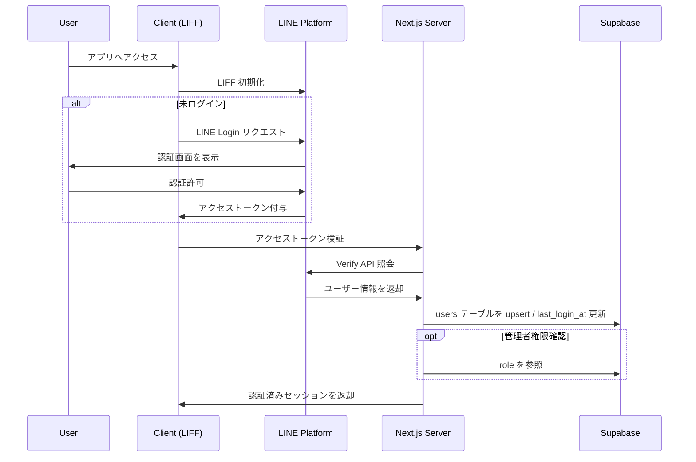
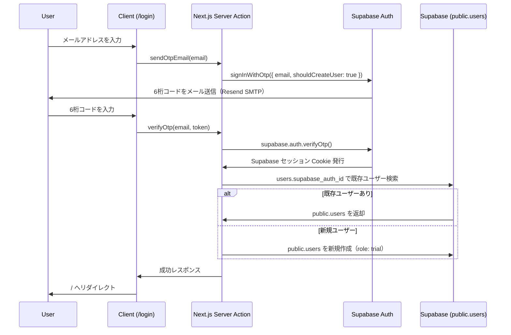
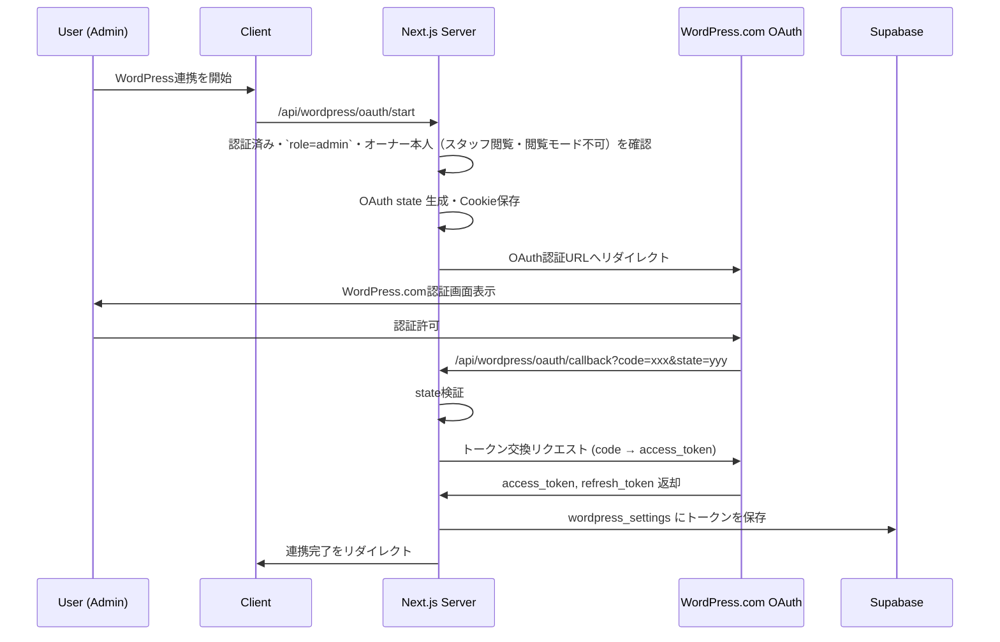
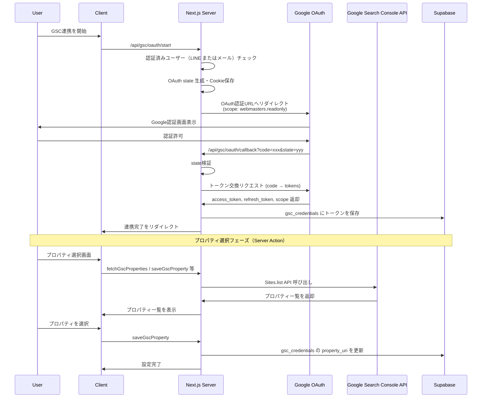
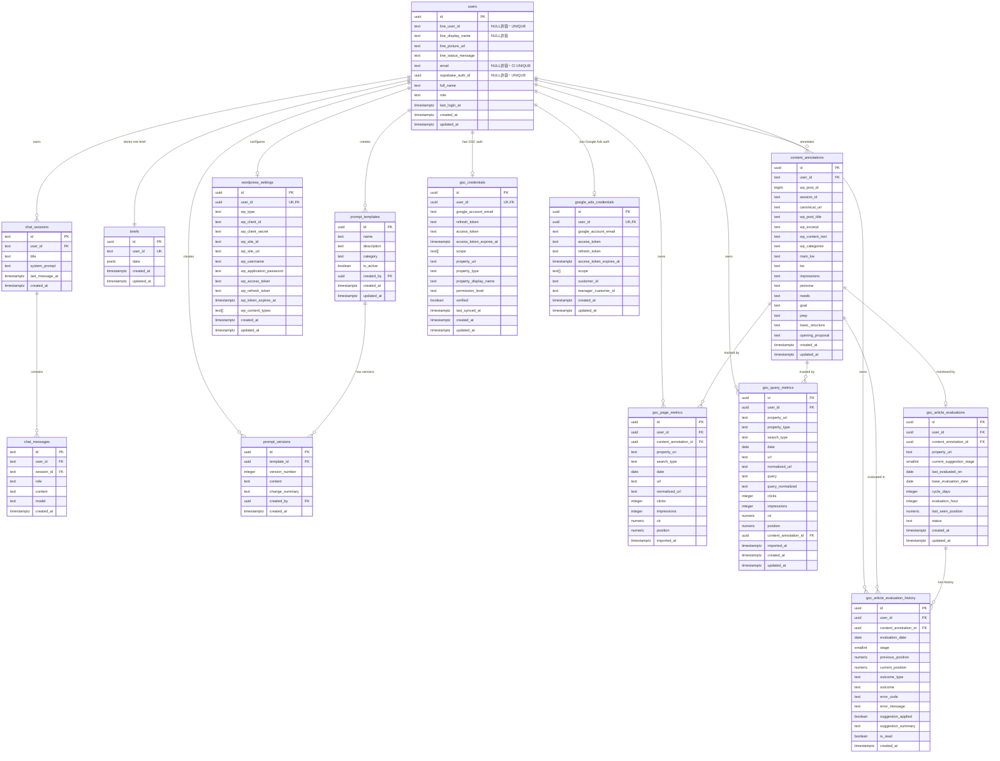

# GrowMate - AIマーケティング支援プラットフォーム

LINE LIFF またはメール OTP を入り口に、業界特化のマーケティングコンテンツを一括生成・管理する SaaS アプリケーションです。Next.js（App Router）を基盤に、マルチベンダー AI、WordPress 連携、Supabase による堅牢なデータ管理を統合しています。フレームワークのバージョンは [`package.json`](package.json) を参照してください。

## 🧭 プロダクト概要

- LIFF でログインしたユーザー向けに、広告／LP／ブログ制作を支援する AI ワークスペースを提供
- Anthropic Claude と OpenAI のモデル（Fine-tuned 含む）を [`src/lib/constants.ts`](src/lib/constants.ts) の `MODEL_CONFIGS` で用途に応じて切り替え
- WordPress.com / 自社ホスティングを問わない投稿取得と、Supabase へのコンテンツ注釈保存
- 管理者向けのプロンプトテンプレート編集・ユーザー権限管理 UI を内蔵

## 🚀 主な機能

### 認証とユーザー管理
- **LINE LIFF 認証**: LIFF（`@line/liff`）による LINE ログインと自動トークンリフレッシュ
- **メール OTP 認証**: Supabase Auth を利用した 6 桁 OTP によるメールログイン
- サーバーサイドの `authMiddleware` で LINE / Email 両セッションを解決し、ロール判定を一元管理
- Supabase `users` テーブルにプロフィール・ロール・最終ログインを保存（`supabase_auth_id` で Auth と紐付け）

### スタッフ招待と閲覧
- 招待リンクの発行・削除・状態取得を `useEmployeeInvitation` / `InviteDialog` で管理
- オーナーのスタッフ閲覧は Cookie 付与と `authMiddleware` 判定で実現

### AI コンテンツ支援ワークスペース
- `app/chat` 配下の ChatLayout で、セッション管理・モデル選択・AI 応答ストリーミングを統合
- 7 ステップのブログ作成フロー（ニーズ整理〜本文作成）と広告／LP テンプレートを提供
- `search_chat_sessions` RPC（PostgreSQL の `websearch_to_tsquery` や ILIKE 等。拡張 `pg_trgm` はマイグレーションで有効化）でオーナー/スタッフ共有アクセスに対応
- ステップ毎のプロンプト変数へ `content_annotations` と `briefs` をマージし、文脈を再利用

### キャンバス編集と選択範囲リライト
- TipTap ベースの `CanvasPanel` に Markdown レンダリング／見出しアウトライン／バージョン履歴を実装
- `POST /api/chat/canvas/stream` で選択範囲と指示を送信し、Claude の Tool Use で全文差し替えを適用

### WordPress 連携とコンテンツ注釈
- WordPress.com OAuth とセルフホスト版 Application Password の両対応（`app/setup/wordpress`）
- `AnnotationPanel` でセッション単位のメモ・キーワード・ペルソナ・PREP 等を保存し、ブログ生成時に再利用

### Google Search Console 連携
- `/setup/gsc` で OAuth 認証・プロパティ選択・連携解除を管理
- 日次指標を `gsc_page_metrics` / `gsc_query_metrics` に保存し、`content_annotations` と normalized_url でマッチング
- 記事ごとの順位評価と改善提案を `gsc_article_evaluations` で管理（タイトル→書き出し→本文→ペルソナの順にエスカレーション、デフォルト30日間隔）

### Google Ads 連携
- `/setup/google-ads` で OAuth 認証・MCC 配下アカウント選択を管理（管理者のみ）
- 選択された `customer_id` を `google_ads_credentials` に保存し、以後の API 呼び出しで使用

### 権限と利用制御
- `trial` / `paid` / `admin` / `unavailable` / `owner` のロールで機能制御
- `canRunBulkImport`（実装は [`src/authUtils.ts`](src/authUtils.ts)）で WordPress / GSC の一括インポート可否を判定。**閲覧専用オーナー**（`role=owner` かつ `ownerUserId` なし）は常に可。**スタッフ**（`ownerUserId` あり）と **`unavailable`** は不可。それ以外のロールは **オーナー閲覧モード**（`isOwnerViewMode`）中は不可

### 管理者ダッシュボード
- `/admin/prompts` でテンプレート編集・バージョン保存
- `/admin/users` でロール切り替え後に `POST /api/auth/clear-cache` でキャッシュを即時無効化

### 事業者情報ブリーフ
- `/business-info` で 5W2H などを入力し、`briefs` テーブルに JSON 保存
- プロンプトテンプレートの変数へ流用し、広告文や LP のコンテキストを自動補完

## 🏗️ システムアーキテクチャ

```mermaid
graph TB
  subgraph Client["Next.js (App Router)"]
    LIFFProvider["LIFF Provider & Auth Hooks"]
    ChatUI["Chat Layout / Session Sidebar"]
    Canvas["CanvasPanel (TipTap)"]
    Annotation["AnnotationPanel"]
    Analytics["Analytics Table"]
    BusinessForm["Business Info Form"]
    AdminUI["Admin Dashboards"]
    GscSetup["GSC Setup Dashboard"]
    GscDashboard["GSC Analytics Dashboard"]
  end

  subgraph Server["Next.js Route Handlers & Server Actions"]
    AuthMiddleware["authMiddleware"]
    ChatStream["/api/chat/anthropic/stream"]
    CanvasStream["/api/chat/canvas/stream"]
    WordPressAPI["/api/wordpress/*"]
    AdminAPI["/api/admin/*"]
    UserAPI["/api/refresh, /api/user/*"]
    GscAPI["/api/gsc/*"]
    GscCron["/api/cron/gsc-evaluate"]
    ServerActions["server/actions/*"]
  end

  subgraph Data["Supabase PostgreSQL"]
    UsersTable["users"]
    SessionsTable["chat_sessions"]
    MessagesTable["chat_messages"]
    BriefsTable["briefs"]
    AnnotationsTable["content_annotations"]
    PromptsTable["prompt_templates"]
    VersionsTable["prompt_versions"]
    WordpressTable["wordpress_settings"]
    GscCredentials["gsc_credentials"]
    GscPageMetrics["gsc_page_metrics"]
    GscQueryMetrics["gsc_query_metrics"]
    GscEvaluations["gsc_article_evaluations"]
    GscHistory["gsc_article_evaluation_history"]
  end

  subgraph External["External Services"]
    LINE["LINE Platform (LIFF / Verify)"]
    Anthropic["Anthropic Claude"]
    OpenAI["OpenAI GPT-4.1 nano FT"]
    WordPress["WordPress REST API"]
    GSC["Google Search Console API"]
  end

  LIFFProvider --> AuthMiddleware
  ChatUI --> ChatStream
  Canvas --> CanvasStream
  Annotation --> ServerActions
  Analytics --> WordPressAPI
  BusinessForm --> ServerActions
  AdminUI --> ServerActions
  GscSetup --> GscAPI
  GscDashboard --> GscAPI

  ServerActions --> UsersTable
  ServerActions --> BriefsTable
  ServerActions --> AnnotationsTable
  ChatStream --> MessagesTable
  ChatStream --> SessionsTable
  WordPressAPI --> WordpressTable
  AdminAPI --> PromptsTable
  AdminAPI --> VersionsTable
  GscAPI --> GscCredentials
  GscAPI --> GscPageMetrics
  GscAPI --> GscQueryMetrics
  GscAPI --> GscEvaluations
  GscCron --> GscEvaluations
  GscCron --> GscHistory

  AuthMiddleware --> LINE
  ChatStream --> Anthropic
  CanvasStream --> Anthropic
  ChatStream --> OpenAI
  WordPressAPI --> WordPress
  GscAPI --> GSC
  GscCron --> GSC
```



GSC の **連携状態・プロパティ選択・切断・インポート** の多くは HTTP の一覧表ではなく、**[`src/server/actions/gscSetup.actions.ts`](src/server/actions/gscSetup.actions.ts)** / **[`gscImport.actions.ts`](src/server/actions/gscImport.actions.ts)** / **[`gscDashboard.actions.ts`](src/server/actions/gscDashboard.actions.ts)** の Server Actions を経由します。OAuth の開始・コールバックとダッシュボード用 JSON は `app/api/gsc/**` の Route Handler を参照してください。

## 🔄 認証フロー

### 1. LINE LIFF 認証フロー（基本認証）



### 2. メール OTP 認証フロー



### 3. WordPress OAuth 認証フロー



### 4. Google Search Console OAuth 認証フロー



## 🛠️ 技術スタック

npm 依存のバージョンは **[`package.json`](package.json)** を正とし、ロックされた解決結果は **[`package-lock.json`](package-lock.json)** を参照してください。以下は名称の列挙のみです。

### フロントエンド

- **フレームワーク**: Next.js（App Router）, React, TypeScript
- **スタイリング**: Tailwind CSS v4, Radix UI, shadcn/ui, lucide-react, tw-animate-css
- **テーマ**: next-themes（ダークモード対応）
- **エディタ**: TipTap, lowlight（シンタックスハイライト）
- **グラフ**: Recharts
- **通知**: Sonner（Toast）
- **Markdown**: react-markdown, remark-gfm

### バックエンド

- **API**: Next.js Route Handlers & Server Actions
- **データベース**: `@supabase/supabase-js`（PostgreSQL + Row Level Security）
- **バリデーション**: Zod
- **ランタイム**: Node.js（LTS 推奨）

### AI・LLM

- **Anthropic**: Claude API（SSE ストリーミング；呼び出しモデル ID は `src/lib/constants.ts` の `MODEL_CONFIGS`）
- **OpenAI**: OpenAI API（Fine-tuned モデル含む；同上）

### 認証・外部連携

- **LINE**: LIFF（`@line/liff`）
- **Supabase Auth + @supabase/ssr**: メール OTP ログイン・セッション管理
- **Resend**: メール OTP 配信（`noreply@mail.growmate.tokyo`）
- **OAuth 2.0**: WordPress.com, Google (Search Console, GA4, Google Ads)
- **WordPress REST API**: 投稿取得・同期
- **Google Search Console API / Google Ads API**

### 開発ツール

- **型チェック**: TypeScript strict mode
- **リンター**: ESLint, eslint-config-next
- **コード整形**: Prettier（`.prettierrc`；CLI は `package.json` の `devDependencies` を参照）
- **ビルド**: Turbopack（開発）/ Next.js build
- **依存関係解析**: Knip
- **ローカル公開**: ngrok（日本リージョン）

## 📊 データベーススキーマ（主要テーブル）



## 📋 環境変数

`.env.local` を手動で用意してください。

### [`src/env.ts`](src/env.ts) で Zod 検証されるもの

起動時に読み込まれます。**クライアント向け**（`NEXT_PUBLIC_*`）はブラウザに公開されます。**サーバー専用**はサーバー側からのみ参照可能です（`env` プロキシ経由）。

| 種別   | 変数名                               | 必須                               | 用途                                                                                   |
| ------ | ------------------------------------ | ---------------------------------- | -------------------------------------------------------------------------------------- |
| Server | `SUPABASE_SERVICE_ROLE`              | ✅                                 | サーバーサイド特権操作用 Service Role キー                                             |
| Server | `OPENAI_API_KEY`                     | ✅                                 | OpenAI API キー                                                                        |
| Server | `ANTHROPIC_API_KEY`                  | ✅                                 | Claude ストリーミング用 API キー                                                       |
| Server | `LINE_CHANNEL_ID`                    | ✅                                 | LINE Login 用チャネル ID                                                               |
| Server | `LINE_CHANNEL_SECRET`                | ✅                                 | LINE Login 用チャネルシークレット                                                      |
| Server | `GOOGLE_OAUTH_CLIENT_ID`             | 任意（GSC/GA4 連携利用時は必須）   | Google Search Console / GA4 OAuth 用クライアント ID                                    |
| Server | `GOOGLE_OAUTH_CLIENT_SECRET`         | 任意（GSC/GA4 連携利用時は必須）   | Google Search Console / GA4 OAuth 用クライアントシークレット                           |
| Server | `GOOGLE_SEARCH_CONSOLE_REDIRECT_URI` | 任意（GSC/GA4 連携利用時は必須）   | Google OAuth のリダイレクト先（`https://<host>/api/gsc/oauth/callback` など）          |
| Server | `WORDPRESS_COM_CLIENT_ID`            | 任意（WordPress 連携利用時は必須） | WordPress.com OAuth 用クライアント ID                                                  |
| Server | `WORDPRESS_COM_CLIENT_SECRET`        | 任意（WordPress 連携利用時は必須） | WordPress.com OAuth 用クライアントシークレット                                         |
| Server | `WORDPRESS_COM_REDIRECT_URI`         | 任意（WordPress 連携利用時は必須） | WordPress OAuth のリダイレクト先（`https://<host>/api/wordpress/oauth/callback` など） |
| Server | `COOKIE_SECRET`                      | 任意                               | WordPress / Google OAuth 等のセキュアな Cookie 管理用シークレット                      |
| Client | `NEXT_PUBLIC_LIFF_ID`                | ✅                                 | LIFF アプリ ID                                                                         |
| Client | `NEXT_PUBLIC_LIFF_CHANNEL_ID`        | ✅                                 | LIFF Channel ID                                                                        |
| Client | `NEXT_PUBLIC_SUPABASE_URL`           | ✅                                 | Supabase プロジェクト URL                                                              |
| Client | `NEXT_PUBLIC_SUPABASE_ANON_KEY`      | ✅                                 | Supabase anon キー                                                                     |
| Client | `NEXT_PUBLIC_SITE_URL`               | ✅                                 | サイトの公開 URL                                                                       |

上表は **17 キー**（サーバー 12 + クライアント 5）。`env.ts` のスキーマと一致させてあります。

### `src/env.ts` に含まれないがコードが参照するもの

Route Handler やサービスが **`process.env` を直接参照**します。`env` オブジェクトからは読めません。

| 変数名 | 必須 | 用途 |
| ------ | ---- | ---- |
| `CRON_SECRET` | 任意（`/api/cron/gsc-evaluate` を使う場合は必須） | GSC 評価バッチの Bearer 認証 |
| `GOOGLE_ADS_REDIRECT_URI` | 任意（Google Ads OAuth 利用時は必須） | [`app/api/google-ads/oauth/*`](app/api/google-ads/oauth) のリダイレクト URI |
| `GOOGLE_ADS_DEVELOPER_TOKEN` | 任意（Google Ads API 利用時は必須） | [`src/server/services/googleAdsService.ts`](src/server/services/googleAdsService.ts) から参照 |

## 🚀 セットアップ手順

### 必要条件

- **Node.js**: LTS 推奨
- **Supabase 接続情報**（管理者から取得）
- **LINE 接続情報**（管理者から取得）
- **ngrok アカウント**（LIFF ローカルテスト用、必須）
- **Resend API キー**（メール OTP を使用する場合、Supabase Dashboard の Custom SMTP に設定）

### 1. インストール

```bash
git clone <repository-url>
cd GrowMate
npm install
```

### 2. Supabase

本番環境と開発環境でプロジェクトを共有しています。管理者から Project URL・anon key・service_role key を取得し `.env.local` に設定してください。

#### マイグレーション運用（このリポジトリの前提）

- **ローカル開発者は、共有 Supabase プロジェクト（本番と同一のリモート）に対して `npx supabase db push` を実行しないこと。** CLI がリモートへスキーマを流し込むと、全員の参照する DB に直接影響するためです。
- スキーマ変更が必要な場合は `supabase/migrations/` に SQL を追加し PR に含める。**リモートへの適用は管理者のみ**が手順に従って行う（SQL Editor、または管理者承認済みの手順でのみ `db push` 等）。
- 初回セットアップで「自分用に DB を流す」必要はない（上記のため、開発者が個別に `db push` する前提ではない）。
- 本番データと同じ DB を使用するため、テストデータは自分のユーザー ID に紐付けて作成し、他のユーザーデータを誤って変更・削除しないよう注意すること
- 直近のマイグレーション概要:
  - スタッフ招待ユーザーのチャット/注釈の所有者移行
  - `get_accessible_user_ids` 追加と `search_chat_sessions` / `get_sessions_with_messages` 更新
  - オーナー/スタッフ共有アクセス向け RLS 更新、オーナーの書き込み禁止
  - `content_annotations.session_id` の制約見直し（UNIQUE へ変更）

### 3. LINE

本番環境と同じ LINE Channel・LIFF アプリを共有しています。管理者から Channel ID・Channel Secret・LIFF ID を取得してください。

> **重要**: LINE Developers Console での設定変更は本番環境にも影響します。設定変更が必要な場合は必ず管理者に相談してください。

### 4. 外部サービス連携

各サービスの OAuth クライアント・API キーを取得し `.env.local` に設定します。Google Ads 用の `GOOGLE_ADS_REDIRECT_URI` / `GOOGLE_ADS_DEVELOPER_TOKEN` および GSC バッチ用の `CRON_SECRET` は、後述の「環境変数」節にある **`src/env.ts` に含まれない** 表のとおり `process.env` を直接参照します。

| サービス | 取得先 | 主な設定変数 |
|---------|--------|------------|
| Google (GSC/GA4/Ads) | [Google Cloud Console](https://console.cloud.google.com/) → OAuth 2.0 クライアント ID | `GOOGLE_OAUTH_CLIENT_ID`, `GOOGLE_OAUTH_CLIENT_SECRET`, 各 `*_REDIRECT_URI` |
| WordPress.com | WordPress.com Developer Portal → アプリ作成 | `WORDPRESS_COM_CLIENT_ID`, `WORDPRESS_COM_CLIENT_SECRET` |

**Google OAuth の注意点**:
- GSC / GA4 / Google Ads は同一 OAuth クライアントを共有できます
- 必要なスコープ: `webmasters.readonly`（GSC）、`analytics.readonly`（GA4）、`adwords`（Google Ads）
- 使用する各リダイレクト URI を Google Cloud Console の「承認済みのリダイレクト URI」に登録してください
- ngrok の静的ドメインを使えば URL が固定されるため、Google Cloud Console の設定変更は不要になります
- Google Ads API には別途 MCC アカウントから発行した開発者トークン（`GOOGLE_ADS_DEVELOPER_TOKEN`）が必要です

### 5. 開発サーバーの起動

```bash
npm run dev
# 型チェックを並行で行う場合
npm run dev:types
```

ブラウザで `http://localhost:3000` にアクセスしてアプリケーションを確認できます。

### 6. ngrok のセットアップ（LIFF 用）

LIFF は HTTPS 環境が必須のため、[ngrok](https://ngrok.com/) の静的ドメインを使用します（無料プランで1つ取得可能）。

```bash
ngrok config add-authtoken <your-authtoken>
# .env.local の NEXT_PUBLIC_SITE_URL に静的ドメインを設定後:
npm run ngrok
```

静的ドメインを使用することで URL が固定され、LINE Developers Console の LIFF エンドポイント URL を毎回変更する必要がなくなります。

### 7. 初期データのセットアップ

1. **管理者ロールの付与**: Supabase の `users` テーブルで自分のユーザーの `role` を `admin` に変更
2. **事業者情報の登録**: `/business-info` で 5W2H などの基本情報を入力
3. **各種連携**（任意）: `/setup/wordpress`・`/setup/gsc`・`/setup/ga4`・`/setup/google-ads` で外部サービスを接続
4. **プロンプトテンプレートの確認**: `/admin/prompts` でデフォルトテンプレートを確認・編集

## ✅ 動作確認

```bash
npm run lint        # ESLint + Next/Tailwind ルール検証
npm run build       # 本番ビルドの健全性チェック
npm run db:stats    # データベース統計確認
npm run vercel:stats # Vercel 統計確認（デプロイ済みの場合）
```

GSC 連携・スタッフ招待など各機能の詳細な検証手順は `testing-and-troubleshooting` スキルを参照してください。

## 📁 プロジェクト構成

```
├── app/
│   ├── chat/                # AI チャットワークスペース（Canvas / Annotation / Step UI）
│   ├── analytics/           # WordPress 投稿 + 注釈ダッシュボード
│   ├── business-info/       # 事業者情報フォーム（Server Components + Actions）
│   ├── setup/               # WordPress / GSC / GA4 / Google Ads 等の初期セットアップ導線
│   ├── login/               # ログインページ
│   ├── invite/[token]/      # スタッフ招待リンク受け付けページ
│   ├── home/                # パブリックホームページ（非認証可）
│   ├── privacy/             # プライバシーポリシー（非認証可）
│   ├── unauthorized/        # 未認可ユーザー向けページ
│   ├── unavailable/         # 利用不可ユーザー向けページ（role が unavailable の場合）
│   ├── terms/               # 利用規約（非認証可）
│   ├── wordpress-import/    # WordPress 記事の一括インポートページ
│   ├── gsc-dashboard/       # GSC ダッシュボードページ
│   ├── gsc-import/          # GSC データインポートページ
│   ├── ga4-dashboard/       # GA4 ダッシュボードページ
│   ├── google-ads-dashboard/# Google Ads ダッシュボードページ
│   ├── admin/               # 管理者向け機能（プロンプト・ユーザー管理）
│   ├── api/                 # Route Handlers（chat, wordpress, admin, auth, user, line, gsc, ga4, google-ads, employee, cron）
│   └── layout.tsx など      # App Router ルートレイアウト
├── src/
│   ├── components/          # 再利用可能な UI（shadcn/ui, AnnotationFormFields 等）
│   ├── domain/              # フロント向けサービス層（ChatService など）
│   ├── hooks/               # LIFF / UI ユーティリティ
│   ├── lib/                 # 定数・プロンプト管理・Supabase クライアント生成
│   ├── server/
│   │   ├── actions/         # Server Actions 経由のビジネスロジック
│   │   ├── middleware/      # 認証・ロール判定ミドルウェア
│   │   ├── services/        # 統合層（WordPress / Supabase / LLM / GSC / GA4 / Google Ads など）
│   │   │   ├── chatService.ts            # チャットセッション管理
│   │   │   ├── gscService.ts             # GSC 基本操作
│   │   │   ├── gscEvaluationService.ts   # GSC 記事評価処理
│   │   │   ├── gscSuggestionService.ts   # GSC 改善提案生成
│   │   │   ├── gscImportService.ts       # GSC データインポート
│   │   │   ├── ga4Service.ts             # GA4 基本操作
│   │   │   ├── ga4ImportService.ts       # GA4 データインポート
│   │   │   ├── googleAdsService.ts       # Google Ads API 連携
│   │   │   ├── analyticsContentService.ts # アナリティクスコンテンツ処理
│   │   │   ├── chatLimitService.ts       # チャット制限管理
│   │   │   └── ... その他サービス
│   │   ├── schemas/         # Zod バリデーションスキーマ
│   │   └── lib/             # サーバー専用ユーティリティ
│   └── types/               # 共通型定義（chat, prompt, annotation, wordpress 等）
├── scripts/                 # ユーティリティスクリプト（DB 統計・Vercel 統計）
├── supabase/migrations/     # データベースマイグレーション
└── config files             # eslint.config.mjs, next.config.ts, tailwind/postcss 設定
```

## 🔧 Route Handlers（`app/api/**/route.ts`）

実装の一覧は `app/api` 配下を正とします。主なものは次のとおりです。

| エンドポイント                      | メソッド | 概要                                                          | 認証 |
| ----------------------------------- | -------- | ------------------------------------------------------------- | ---- |
| `/api/chat/anthropic/stream`        | POST     | Claude とのチャット SSE ストリーム                            | LIFF Bearer または Supabase メールセッション（`authMiddleware`） |
| `/api/chat/canvas/stream`           | POST     | Canvas 編集（選択範囲差し替え）                               | 同上 |
| `/api/chat/canvas/load-wordpress`   | POST     | WordPress 記事を Canvas に読み込み                            | 同上 |
| `/api/refresh`                      | POST     | LINE リフレッシュトークンからアクセストークン再発行           | Cookie (`line_refresh_token`) |
| `/api/user/current`                 | GET      | ログインユーザーのプロファイル・ロール情報                    | `Authorization: Bearer` または `line_access_token` Cookie。無トークン時はメールセッション解決 |
| `/api/auth/check-role`              | GET      | ロールのサーバー検証                                          | Cookie / セッション |
| `/api/auth/clear-cache`             | POST     | Edge キャッシュクリア通知                                     | 任意 |
| `/api/auth/line-oauth-init`         | GET      | LINE OAuth state 生成                                         | Cookie |
| `/api/line/callback`                | GET      | LINE OAuth コールバック                                       | 公開（state チェック） |
| `/api/wordpress/*`                  | 各種     | 設定・接続テスト・投稿取得・OAuth                             | Cookie 等（ルートごとに [`app/api/wordpress`](app/api/wordpress) を参照） |
| `/api/admin/prompts`                | GET      | プロンプトテンプレート一覧（管理者）                          | Cookie + admin |
| `/api/admin/prompts/[id]`           | POST     | テンプレート更新・バージョン生成                              | Cookie + admin |
| `/api/gsc/oauth/start`              | GET      | GSC OAuth リダイレクト開始                                    | 公開（環境変数必須） |
| `/api/gsc/oauth/callback`           | GET      | GSC OAuth コールバック                                        | Cookie |
| `/api/gsc/dashboard`                | GET      | GSC ダッシュボード用・注釈一覧など（クエリで絞り込み）         | Cookie / セッション |
| `/api/gsc/dashboard/[annotationId]` | GET    | 注釈別の GSC 関連データ                                       | Cookie / セッション |
| `/api/gsc/evaluate`                 | POST     | GSC 記事評価の手動実行                                        | Cookie / セッション |
| `/api/gsc/evaluations/register`     | POST     | GSC 評価対象の登録                                            | Cookie / セッション |
| `/api/gsc/evaluations/update`       | POST     | GSC 評価設定の更新                                            | Cookie / セッション |
| `/api/cron/gsc-evaluate`            | POST     | GSC 記事評価の定期実行                                        | `Authorization: Bearer <CRON_SECRET>`（`CRON_SECRET` は `env.ts` 外） |
| `/api/google-ads/*`                 | 各種     | OAuth・MCC アカウント・キーワード等                           | 主に admin（[`app/api/google-ads`](app/api/google-ads) を参照） |
| `/api/ga4/*`                        | 各種     | 同期・設定・プロパティ・キーイベント                          | Cookie / セッション |
| `/api/employee/*`                   | 各種     | スタッフ招待                                                  | Cookie / 一部公開 |

**GSC 評価バッチ**: `CRON_SECRET` を `.env.local` に設定し、`Authorization: Bearer <CRON_SECRET>` で `/api/cron/gsc-evaluate` を呼び出します。

### GSC 連携の Server Actions（Route Handler ではない）

次は **`app/api/gsc/status` などのパスは存在しません**。UI から [`src/server/actions/gscSetup.actions.ts`](src/server/actions/gscSetup.actions.ts) 等を呼び出します。

| ファイル | 主なエクスポート | 概要 |
| -------- | ---------------- | ---- |
| `gscSetup.actions.ts` | `fetchGscStatus`, `fetchGscProperties`, `saveGscProperty`, `disconnectGsc`, `refetchGscStatusWithValidation` | 連携状態・プロパティ・切断 |
| `gscImport.actions.ts` | `runGscImport` | 日付範囲の GSC 指標インポート |
| `gscDashboard.actions.ts` | `fetchGscDetail`, `registerEvaluation`, `updateEvaluation`, `runEvaluationNow`, ほか | 注釈別詳細・評価登録・手動評価 |
| `gscNotification.actions.ts` | `getUnreadSuggestionsCount`, `markSuggestionAsRead`, ほか | 改善提案の未読・既読 |

## 🛡️ セキュリティと運用の注意点

- Supabase では主要テーブルに RLS を適用済み（開発ポリシーが残る箇所は運用前に見直す）
- `authMiddleware` がロールを検証し、管理者権限とオーナー/スタッフ関係に基づくアクセス制御を担保
- `get_accessible_user_ids` と RLS により、オーナー/スタッフの共有アクセスとオーナー読み取り専用を担保
- WordPress アプリケーションパスワードや OAuth トークンは HTTP-only Cookie に保存（本番では安全な KMS / Secrets 管理を推奨）
- SSE は 20 秒ごとの ping と 5 分アイドルタイムアウトで接続維持を調整
- `AnnotationPanel` の URL 正規化で内部／ローカルホストへの誤登録を防止

## 🗄️ Supabase バックアップ（Freeプラン / 週次）

GitHub Actions + GCS で週次バックアップを実行します（Storage は対象外、DB のみ）。

- **GCS バケット**: `grow_mate`（us-central1、ライフサイクル60日で削除）
- **実行スケジュール**: 日曜12:00 JST（`.github/workflows/supabase-backup.yml`）
- **復旧手順**: GCS から `.sql.gz` を取得 → `gunzip` → `psql` で role → schema → data の順に適用
- **注**: GitHub の無活動による Actions 無効化を防ぐ必要がある場合は、リポジトリの運用方針に合わせて別途ワークフローを追加してください（本リポジトリに `keepalive.yml` は含めていません）。

GitHub Secrets に `GCP_PROJECT_ID`・`GCS_BUCKET_NAME`・`GCP_SERVICE_ACCOUNT_KEY`・`SUPABASE_DB_URL` を登録してください。

## 📱 デプロイと運用

- Vercel を想定（Edge Runtime と Node.js Runtime をルートごとに切り分け）
- デプロイ前チェック: `npm run lint` → `npm run build`
- 環境変数は Vercel Project Settings へ反映し、本番は WordPress 本番サイトなどの外部連携設定に切り替え
- **Supabase スキーマ**: Vercel のデプロイだけでは DB は更新されない。変更は `supabase/migrations/` にコミットし、マイグレーション内にロールバック案をコメントで残す。**本番（共有プロジェクト）への適用タイミングと手順は「ローカル環境のセットアップ → 2. Supabase」のマイグレーション運用に従う。**

## 🤝 コントリビューション

1. フィーチャーブランチを作成
2. 変更を実装し、`npm run lint` の結果を確認
3. 必要に応じて `supabase/migrations/` にマイグレーションを追加し、ロールバック手順を明記する。**共有プロジェクトへの適用は管理者に依頼し、自分で `npx supabase db push` をリモートに対して実行しないこと**（「2. Supabase」を参照）
4. 変更内容を簡潔にまとめた PR を作成（ユーザー影響・環境変数・スクリーンショットを添付）

## 📄 ライセンス

このリポジトリは私的利用目的で運用されています。再配布や商用利用は事前相談のうえでお願いいたします。
