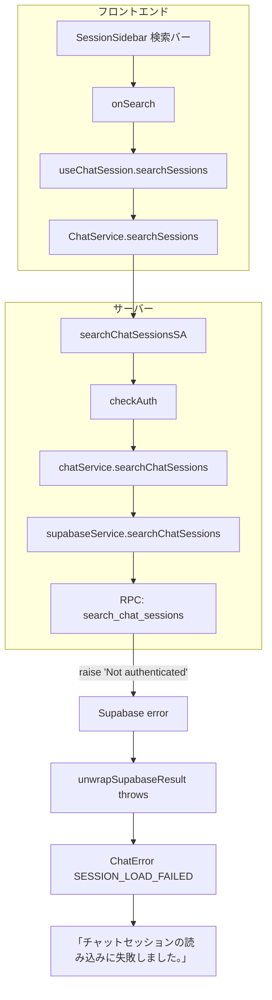

# チャット検索エラー修正 仕様書

> チャットルームのサイドバー検索で「チャットセッションの読み込みに失敗しました。」が表示される問題の修正仕様。

**注記（行番号について）**: 本仕様書に記載の行番号（例: L375, L405-454）は作成時点のものであり、コード変更により変わる可能性があります。参照時はファイル内検索で該当箇所を特定してください。

## 1. 目的

チャットルームの検索機能を正常に動作させる。ユーザーが検索バーに文字を入力した際、エラーなく検索結果が表示されるようにする。

## 2. スコープ

- **対象**: Supabase RPC `search_chat_sessions` および `get_sessions_with_messages` の認証チェック修正
- **非対象**: 検索アルゴリズムの変更、UI の変更、フロントエンドのエラーハンドリング変更

## 3. 問題の概要

### 3.1 現象

- **トリガー**: チャット画面のサイドバー検索バーに文字を入力して検索を実行
- **表示**: 「チャットセッションの読み込みに失敗しました。」
- **エラーコード**: `ChatErrorCode.SESSION_LOAD_FAILED`

### 3.2 エラー発生フロー



### 3.3 関連ファイル

| ファイル | 役割 |
| -------- | ---- |
| `app/chat/components/ChatLayoutContent.tsx` L375 | 検索トリガー `onSearch` |
| `src/hooks/useChatSession.ts` L405-454 | `searchSessions` コールバック、エラーを `searchError` に格納 |
| `src/domain/services/chatService.ts` L184-226 | `searchChatSessionsSA` 呼び出し、`result.error` で `ChatError` スロー |
| `src/server/actions/chat.actions.ts` L285-321 | Server Action、`chatService.searchChatSessions` 呼び出し |
| `src/server/services/chatService.ts` L409-441 | サーバー側 ChatService、`supabaseService.searchChatSessions` 呼び出し |
| `src/server/services/supabaseService.ts` L570-612 | RPC `search_chat_sessions` 呼び出し |
| `supabase/migrations/20260107000001_update_chat_rpcs.sql` | 問題の RPC 定義（L32-35, L142-145） |

## 4. 根本原因

### 4.1 session_user チェックの不備

`supabase/migrations/20260107000001_update_chat_rpcs.sql` の `search_chat_sessions` および `get_sessions_with_messages` では、`auth.uid()` が null の場合に次のチェックを行っている:

```sql
if session_user <> 'service_role' then
  raise exception 'Not authenticated';
end if;
```

### 4.2 PostgREST 経由時の session_user

`supabase/migrations/20260108000000_fix_delete_employee_auth_check.sql` のコメントにある通り:

> **Service Role で実行されている場合、PostgRESTを経由すると session_user は 'authenticator' になります**

- Server Action は Service Role クライアント経由で RPC を呼ぶ
- そのため `auth.uid()` は null、`session_user` は `'authenticator'` となる
- `'authenticator'` は `'service_role'` と異なるため、`raise exception 'Not authenticated'` が発生する

### 4.3 参考: 既存の正しい実装

`delete_employee_and_restore_owner` では `'authenticator'` を許可している:

```sql
IF session_user NOT IN ('service_role', 'authenticator') THEN
  RETURN QUERY SELECT false, 'Not authenticated - session_user: ' || session_user;
  RETURN;
END IF;
```

## 5. 修正仕様

### 5.1 修正方針

新規マイグレーションで `search_chat_sessions` と `get_sessions_with_messages` の認証チェックを修正する。`delete_employee_and_restore_owner` と同様に `'authenticator'` を許可する。

### 5.2 修正内容

**修正前:**

```sql
if session_user <> 'service_role' then
  raise exception 'Not authenticated';
end if;
```

**修正後:**

```sql
if session_user not in ('service_role', 'authenticator') then
  raise exception 'Not authenticated';
end if;
```

### 5.3 修正対象

| 関数名 | ファイル | 行番号 |
| ------ | -------- | ------ |
| `search_chat_sessions` | `supabase/migrations/20260107000001_update_chat_rpcs.sql` | L33 |
| `get_sessions_with_messages` | `supabase/migrations/20260107000001_update_chat_rpcs.sql` | L143 |

### 5.4 マイグレーション作成ルール

- 新規マイグレーションファイルを `supabase/migrations/` に作成
- ファイル名: `YYYYMMDDHHMMSS_fix_chat_rpcs_authenticator_auth.sql` 形式
- **既存の関数定義全体をコピーし、認証チェック部分のみを修正すること**。`create or replace function` では関数全体の再定義が必要なため、認証チェックだけを変更して他ロジックのコピーを忘れると不具合の原因となる
- ロールバック案をコメントで記載する（AGENTS.md 準拠）

## 6. 実装詳細

### 6.1 マイグレーションの構成

1. `search_chat_sessions` の `create or replace function` を実行
   - **`supabase/migrations/20260107000001_update_chat_rpcs.sql` から関数定義全体をコピー**し、認証チェック部分（L32-35 相当）のみを修正する
   - その他のロジック（`websearch_to_tsquery` の例外ハンドリング等）は変更しない
2. `get_sessions_with_messages` の `create or replace function` を実行
   - **同ファイルから関数定義全体をコピー**し、認証チェック部分（L142-145 相当）のみを修正する
   - その他のロジックは変更しない
3. ロールバック案をコメントで記載

### 6.2 ロールバック案

#### 推奨: ロールバック用マイグレーションの新規作成

Supabase の標準的なアプローチに従い、**新規マイグレーションで前の状態に戻す**ことを推奨する。

1. 新規ファイル `supabase/migrations/YYYYMMDDHHMMSS_rollback_chat_rpcs_authenticator_auth.sql` を作成
2. `20260107000001_update_chat_rpcs.sql` の関数定義（認証チェックを `session_user <> 'service_role'` に戻したもの）をそのまま記載
3. `npx supabase db push` で適用

#### 緊急時の手動ロールバック

本番で問題が発生し、マイグレーション作成前に即時復旧が必要な場合:

```sql
-- Supabase Dashboard の SQL Editor で実行、または supabase db execute で実行
-- search_chat_sessions の認証チェックを session_user <> 'service_role' に戻す
-- （20260107000001 の関数定義を復元。create or replace function で関数全体を再実行）
```

手順: `20260107000001_update_chat_rpcs.sql` の内容をコピーし、認証チェック部分を `if session_user <> 'service_role' then` に戻してから実行する。**後から正式なロールバックマイグレーションを追加し、履歴を残すこと。**

#### ロールバック後の検証

1. 検索機能がエラーになること（修正前の状態に戻る）
2. セッション一覧がエラーになること（`get_sessions_with_messages` も同様）
3. ロールバックが意図どおりであることを確認したうえで、改修マイグレーションを再適用する

## 7. 検証手順

### 7.1 事前準備

1. `npx supabase db push` でマイグレーションを適用
2. 開発サーバーを起動（`npm run dev`）
3. LIFF 認証済みのチャット画面に遷移

### 7.2 検索機能の検証

1. サイドバーの検索バーに文字（例: タイトルや URL の一部）を入力
2. 検索結果が表示されること
3. 「チャットセッションの読み込みに失敗しました。」が表示されないこと
4. 検索結果からセッションをクリックし、該当チャットが開くこと

### 7.3 セッション一覧の検証

1. 検索バーをクリア（空にする）
2. セッション一覧が正常に表示されること
3. エラーが表示されないこと

### 7.4 ロール別検証（必須）

RLS ポリシーと `get_accessible_user_ids` によるオーナー/スタッフ共有アクセス制御が正しく機能していることを確認する。**本検証は必須とする。**

| ロール | 検証内容 | 期待結果 |
| ------ | -------- | -------- |
| 有料契約オーナー | 検索・セッション一覧を実行 | 自身のデータのみ表示。検索・一覧が正常に動作すること |
| スタッフ | 検索・セッション一覧を実行 | オーナーのデータを含めて検索・一覧が動作すること（`get_accessible_user_ids` でオーナー ID が含まれること） |
| 閲覧専用オーナー | 検索・セッション一覧を実行 | 閲覧のみ可能。検索・一覧が動作すること |
| 利用停止ユーザー | 検索を実行 | サービス利用制限のエラーが返ること |

### 7.5 ネガティブテスト

認証が失敗すべきケースで、正しくエラーが返ることを確認する。

| テストケース | 手順 | 期待結果 |
| ------------ | ---- | -------- |
| 無効なトークン | LIFF トークンを無効化（ログアウトまたはトークン破棄）した状態で検索を実行 | 認証エラーが返ること。「チャットセッションの読み込みに失敗しました。」または認証系のエラーメッセージが表示されること |
| 期限切れセッション | セッション期限切れ後に検索を実行 | 認証エラーまたは再ログインを促すメッセージが返ること |
| 空のトークン | `liffAccessToken` が空の状態で Server Action を呼び出す（開発者ツール等で検証） | `checkAuth` で認証失敗。`result.error` が返ること |

### 7.6 セキュリティ検証

認証チェックの変更により、**アクセス権のないユーザーが他のユーザーのチャットセッションにアクセスできないこと**を確認する。`authenticator` を許可しても、RPC 内の `get_accessible_user_ids(p_user_id)` により `p_user_id` に紐づくデータのみが返る設計であることを検証する。

| 検証項目 | 手順 | 期待結果 |
| -------- | ---- | -------- |
| 他ユーザーデータの非漏洩 | ユーザー A でログインし、検索・セッション一覧を実行 | ユーザー A のデータのみ表示。ユーザー B のセッションが含まれないこと |
| スタッフのアクセス範囲 | スタッフアカウントでログインし、検索を実行 | オーナーのセッションのみ表示。他オーナーのセッションは含まれないこと |
| p_user_id の検証 | RPC は Server Action から `targetUserId`（`auth.ownerUserId \|\| auth.userId`）を渡される | `checkAuth` で検証済みのユーザー ID のみが RPC に渡され、`get_accessible_user_ids` でフィルタされた結果のみが返ること |

**補足**: RLS ポリシーで `get_accessible_user_ids` を通じてアクセス制御し、オーナー/スタッフ共有アクセスの判定に使用している。本修正は `session_user` の許可範囲を広げるのみで、`p_user_id` の検証や `get_accessible_user_ids` のロジックは変更しない。そのため、既存のアクセス制御が維持されることを確認すればよい。

## 8. 開発工数見積もり

| タスク | 工数 | 備考 |
| ------ | ---- | ---- |
| マイグレーション作成 | 1.5h | 2 関数修正、ロールバック案コメント、既存パターン確認、型・構文チェック |
| ローカル検証 | 1.5h | `db push`、検索・セッション一覧の動作確認、エッジケース、スタッフ/オーナー別確認 |
| 想定外対応バッファ | 1.5h | マイグレーション失敗時の調査、別原因の切り分け、ロールバック検証、環境差異 |
| セルフレビュー・Lint・コミット | 0.5h | AGENTS.md 準拠の 2 パスレビュー、`npm run lint`、`git diff` 確認、PR 記載 |
| **合計** | **5h** | 最小 1.25h / 標準 2.5h / 余裕込み 5h（0.5 人日相当） |

### 8.1 稼働前提

- 1 日あたり 3h 稼働の場合: 約 2 日で完了
- 3 日確保すれば十分な余裕あり

## 9. 補足: その他の可能性（優先度低）

- **websearch_to_tsquery の例外**: `syntax_error` は既にハンドリング済み。該当箇所: `supabase/migrations/20260107000001_update_chat_rpcs.sql` の `search_chat_sessions` 関数内 L80-86（`begin ... exception when syntax_error then ... end` ブロック）。`websearch_to_tsquery('simple', v_query)` が不正なクエリで `syntax_error` を投げた場合、`v_has_tsquery := false` となり全文検索はスキップされ、ILIKE と URL 完全一致でフォールバックする。他の例外は稀だが、必要なら `when others` でフォールバック可能。
- **get_accessible_user_ids(p_user_id::uuid)**: `p_user_id` は `auth.userId` 由来のため、通常は有効な UUID。不正な値の場合は別エラーになる。

## 10. 変更履歴

| 日付 | 内容 |
| ---- | ---- |
| 2026-03-06 | 初版作成 |
| 2026-03-06 | 検証手順にネガティブテスト・セキュリティ検証追加、ロール別検証を必須化 |
| 2026-03-06 | 行番号注記、syntax_error 参照、マイグレーション全体コピー明記、ロールバック案の具体化 |
