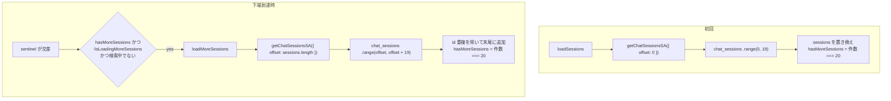

# チャット履歴アクセス修正 仕様書（検索エラー＋一覧の無限スクロール）

> 21件目以降のチャットセッションに到達できない問題を、**検索エラーの修正**と**セッション一覧の無限スクロール**の2点で1PRにまとめて解消する。

**状態（2026-09-15 時点）**: 未実装。本書は `docs/plans/chat-search-fix-spec.md` と `docs/plans/sidebar-session-infinite-scroll-spec.md`（いずれも 2026-03-06 初版）を統合し、現行コードに合わせて書き直したもの。旧2ファイルは削除した。「現状」はコードとマイグレーションの照合結果であり、実DBでの検索エラーの再現は実装着手時に 8.1 で確認する。

**注記（参照箇所について）**: 行番号は変わりやすいため、本書では関数名・シンボル名で参照する。

## 1. 目的

チャット履歴のうち、直近20件より古いセッションにもユーザーが到達できるようにする。

- **A. 検索**: 検索バーに文字を入力したとき、エラーなく検索結果が表示される
- **B. 一覧**: セッション一覧を下にスクロールすると、21件目以降が順に追加表示される

### 1.1 1PRにまとめる理由

現状は、一覧が20件で止まり、それ以前のセッションを探す唯一の手段である検索も失敗する。つまり21件目以降に到達する手段が無い。A・B のどちらか一方だけでは「古い履歴を開けない」というユーザー側の問題が解消しないため、同時にリリースする。

A はマイグレーションのみ、B は TypeScript と UI のみで、変更層は重ならない。旧仕様にあった「B は A のマイグレーション適用が前提」という依存は、一覧取得が RPC を使わなくなったため（3.2）現在は無い。

## 2. スコープ

- **対象 A**: Supabase RPC `search_chat_sessions` の認可チェックとデータ範囲の修正、実行権限の service_role 限定
- **対象 B**: セッション一覧取得への offset 追加と、サイドバーの無限スクロール
- **ロール**: 既存機能（チャット履歴）の不具合修正のため、提供ロールは現状どおりとする。新規機能の `admin` / `paid` 限定ルールは適用しない（`unavailable` は従来どおり `checkAuth` で拒否される）

### 2.1 Non-goals

| 項目 | 理由 |
| ---- | ---- |
| `get_sessions_with_messages` RPC の修正・拡張 | コミット `ac48ae0b`（2026-08-08）でアプリは同 RPC を呼ばなくなった。一覧は直接クエリで取得している |
| 未使用 RPC（`get_sessions_with_messages`）の DROP | 呼び出し元が無く実害が無い。本件の解消に不要 |
| 検索結果の無限スクロール | 検索は最大 `p_limit` 件（既定 20）の関連度順で足りる。一覧側で古い履歴に到達できるため |
| 検索アルゴリズムの変更 | 全文検索・URL 一致・タイトル ILIKE のロジックは変更しない |
| 一覧取得時のメッセージ本文取得の廃止 | `SupabaseService.getSessionsWithMessages` はメッセージも取得するが、唯一の呼び出し元 `getChatSessions` はメッセージを捨てている。無駄ではあるが既存挙動で、本件の解消に不要。1ページあたりの取得量は現状と同じ |
| 一覧の並び順変更、UI デザインの変更 | 並びは `last_message_at` 降順のまま。追加するのは下端の読み込み表示のみ |
| authenticated（ユーザー JWT）経路からの検索 RPC 呼び出し許可 | 呼び出し元は Service Role クライアントの `SupabaseService.searchChatSessions` のみ |
| `src/types/database.types.ts` の再生成 | `search_chat_sessions` のシグネチャと戻り値は変更せず、B は DB 変更が無いため不要。なお同ファイルは `ac48ae0b` で手編集されており、再生成すると本件と無関係な差分が出うるため、本 PR では再生成しない |
| ページング中の他端末での削除・並び替えへの完全追従 | 11.2 のとおり id 重複排除で実用上足りる。完全な整合が必要になったらキーセットページングへ移行する |
| 一覧に無いセッション（検索結果・URL から開いたもの）への送信時に、そのセッションを一覧先頭へ追加する | 現状も送信後に一覧へ出ない（リロードで出る）。本件で悪化しない既存挙動のため対象外（11.2） |

## 3. 問題の概要

### 3.1 現象

| | トリガー | 表示 |
| - | -------- | ---- |
| A | 検索バー（`ChatSearch`）に文字を入力して検索 | 「チャットセッションの読み込みに失敗しました。」（`ChatErrorCode.SESSION_LOAD_FAILED`） |
| B | セッション一覧をスクロール | 20件で止まり、21件目以降が表示されない。「もっと見る」等も無い |

### 3.2 データフロー（現状）

```mermaid
flowchart TD
    subgraph Search [A. 検索]
        A1["InputArea 内 ChatSearch"] --> A2[useChatSession.searchSessions]
        A2 --> A3[domain ChatService.searchSessions]
        A3 --> A4[searchChatSessionsSA]
        A4 --> A5[server chatService.searchChatSessions]
        A5 --> A6["SupabaseService.searchChatSessions"]
        A6 --> A7["RPC search_chat_sessions（Service Role）"]
        A7 -->|"raise 'Not authenticated'"| A8["ERROR_MESSAGES.CHAT.SESSION_SEARCH_FAILED"]
        A8 --> A9["ChatError SESSION_LOAD_FAILED を画面表示"]
    end

    subgraph List [B. 一覧]
        B1["ChatClient（認証確定後1回）"] --> B2[useChatSession.loadSessions]
        B2 --> B3[domain ChatService.loadSessions]
        B3 --> B4["getChatSessionsSA（引数なし）"]
        B4 --> B5["server chatService.getSessionsWithMessages(userId)"]
        B5 --> B6["SupabaseService.getSessionsWithMessages<br/>limit = options?.limit ?? 20"]
        B6 --> B7["chat_sessions を .limit(20) で直接取得"]
    end
```



A の画面文言は、認証失敗（`checkAuth`）でも RPC 失敗でも同じになる。原因の切り分けはサーバーログ `Failed to search chat sessions:` の中身で行う。

### 3.3 関連ファイル

| ファイル | 役割 |
| -------- | ---- |
| `app/chat/ChatClient.tsx` | 認証確定後に `loadSessions` を1回だけ呼ぶ |
| `app/chat/components/ChatLayoutContent.tsx` | `SessionSidebar`（デスクトップ／モバイル Sheet）と `InputArea` に state・actions を渡す |
| `app/chat/components/InputArea.tsx` | 検索 UI `ChatSearch`（デスクトップはヘッダー内、モバイルはヘッダー下） |
| `app/chat/components/SessionSidebar.tsx` | 一覧／検索結果の切り替え、`sessionListRef` の生成 |
| `src/components/SessionListContent.tsx` | 一覧の描画。内側の `overflow-y-auto` 要素（`sessionListRef`）がスクロールコンテナ。検索結果の描画にも使われる |
| `src/types/components.ts` | `SessionListContentProps` |
| `src/hooks/useChatSession.ts` | `loadSessions` / `searchSessions` / `deleteSession`、新規セッション作成時の一覧先頭追加 |
| `src/types/hooks.ts` | `ChatSessionActions` |
| `src/domain/models/chatModels.ts` | `ChatState` / `initialChatState` |
| `src/domain/interfaces/IChatService.ts` | `loadSessions` / `searchSessions` |
| `src/domain/services/chatService.ts` | `loadSessions` / `searchSessions` |
| `src/server/actions/chat.actions.ts` | `getChatSessions`（`getChatSessionsSA`）/ `searchChatSessions`（`searchChatSessionsSA`）/ `checkAuth` |
| `src/server/services/chatService.ts` | `getSessionsWithMessages` / `searchChatSessions` |
| `src/server/services/supabaseService.ts` | `getSessionsWithMessages`（直接クエリ）/ `searchChatSessions`（RPC） |
| `src/lib/constants.ts` | 定数（`GA4_RANKING_PAGE_SIZE` 等のページサイズ定数の置き場） |
| `src/domain/errors/error-messages.ts` | `ERROR_MESSAGES.CHAT` |
| `supabase/migrations/20260107000001_update_chat_rpcs.sql` | 現行の `search_chat_sessions` 定義（A の修正対象） |

## 4. 根本原因

### 4.1 A: Service Role 経路の判定に `session_user` を使っている

`search_chat_sessions` は `auth.uid()` が null の場合に次のチェックを行う:

```sql
if session_user <> 'service_role' then
  raise exception 'Not authenticated';
end if;
```

PostgREST 経由の呼び出しでは、接続ロールは常に `authenticator` で、リクエストごとに `SET ROLE` で `service_role` / `anon` / `authenticated` に切り替わる。`session_user` は接続ロールの `authenticator` のままなので、Service Role クライアントからの呼び出しでも `'service_role'` と一致せず、`Not authenticated` が発生する（`supabase/migrations/20260108000000_fix_delete_employee_auth_check.sql` のコメントにも同じ記録がある）。

### 4.2 A: 旧オーナー/スタッフ共有モデルへの依存

同関数はデータ範囲を `public.get_accessible_user_ids(...)` で決めている。オーナー/スタッフ共有モデルはアプリ側で廃止済み（`ac48ae0b`）で、最近の RPC（`get_filtered_content_annotations`、GA4 ダッシュボード集計 RPC 等）は `user_id = p_user_id` の自己参照に揃っている。

`src/types/database.types.ts` からは `get_accessible_user_ids` と `users.owner_user_id` が消えているが、これらを DROP するマイグレーションは無い。実DBに関数が残っているかは未確認のため、修正後の定義はこの関数に依存しないものとする。

### 4.3 B: limit が固定で、offset が無い

| 層 | 現状 |
| -- | ---- |
| Server Action `getChatSessions` | 引数なしで `chatService.getSessionsWithMessages(auth.userId)` を呼ぶ |
| `SupabaseService.getSessionsWithMessages` | `options?.limit ?? 20` で `.limit(limit)`。offset を受け取る口が無い |
| 一覧 UI | 追加取得の導線が無い |

## 5. 修正仕様 A: 検索 RPC

### 5.1 修正方針

旧仕様の「`session_user` に `'authenticator'` を追加で許可する」方式は**採用しない**。PostgREST 経由では anon キーの呼び出しも `session_user = 'authenticator'` かつ `auth.uid()` が null になるため、この方式では未ログインの呼び出し元が任意の `p_user_id` を指定して他人のセッションを検索できてしまう。

代わりに、`.claude/skills/supabase/rls.md` の Service Role 専用 RPC 規約と、既存 RPC（`20260826000100_fix_start_ga4_content_evaluation_ambiguous_column.sql` 等）のパターンに揃える。

1. 認可チェックを `auth.role() is distinct from 'service_role'` に置き換える（JWT の無い接続で `auth.role()` が NULL の場合も拒否するため、既存 RPC の `<>` ではなく `is distinct from` を使う）
2. データ範囲を `cs.user_id = p_user_id` の自己参照にし、`get_accessible_user_ids` への依存を外す
3. `PUBLIC` / `anon` / `authenticated` から `EXECUTE` を revoke し、`service_role` のみに grant する

### 5.2 修正内容

**修正前（認可とデータ範囲）:**

```sql
if auth.uid() is null then
  if session_user <> 'service_role' then
    raise exception 'Not authenticated';
  end if;
  v_accessible_ids := public.get_accessible_user_ids(p_user_id::uuid);
else
  v_accessible_ids := public.get_accessible_user_ids(auth.uid());
  -- ...（オーナー/スタッフ分岐）
end if;
-- ...
where cs.user_id = any(v_accessible_ids)
```

**修正後:**

```sql
if auth.role() is distinct from 'service_role' then
  raise exception 'service role required';
end if;
-- ...
where cs.user_id = p_user_id
```

- 変数 `v_accessible_ids` は削除する
- `where cs.user_id = any(v_accessible_ids)` は2箇所（空クエリ分岐と通常検索）とも `cs.user_id = p_user_id` に置き換える
- 関数定義の後に次を追加する:

```sql
revoke execute on function public.search_chat_sessions(text, text, integer) from public, anon, authenticated;
grant execute on function public.search_chat_sessions(text, text, integer) to service_role;
```

### 5.3 変更しないもの

- 関数シグネチャ・戻り値の列
- `language plpgsql` / `stable` / `security definer` / `set search_path = public`
- `p_limit` の検証（1〜100、既定 20）
- クエリ正規化（`normalize_url`、ILIKE エスケープ）
- `websearch_to_tsquery` の `syntax_error` フォールバック
- スコア計算と並び順（`similarity_score desc, cs.last_message_at desc`）

### 5.4 マイグレーション

- ファイル名: `supabase/migrations/YYYYMMDDHHMMSS_fix_search_chat_sessions_service_role_auth.sql`
- 構成: 冒頭コメント（修正理由＝4.1・4.2 の要約、Rollback）→ `create or replace function public.search_chat_sessions(...)` → `revoke` / `grant`
- `20260107000001_update_chat_rpcs.sql` の `search_chat_sessions` 定義全体をコピーし、5.2 の箇所だけを変更する。`create or replace function` は関数全体の再定義になるため、他ロジックのコピー漏れは不具合に直結する

### 5.5 ロールバック

修正前の定義は検索が常に失敗する状態のため、ロールバックは「不具合状態に戻す」ことを意味する。新定義に問題があった場合の退避手段としてのみ使う。

- マイグレーションのコメントに次の手順を記載する:
  1. `20260107000001_update_chat_rpcs.sql` の `search_chat_sessions` 定義を再実行する
  2. `grant execute on function public.search_chat_sessions(text, text, integer) to public;` で既定権限に戻す
- 本番へ適用する場合は、正式なロールバックマイグレーションとして追加し履歴を残す

## 6. 修正仕様 B: セッション一覧の無限スクロール

### 6.1 振る舞い

- **初回**: 直近 `SESSION_LIST_PAGE_SIZE`（20）件を取得して表示する
- **追加取得**: 一覧の下端がスクロールコンテナ内に入ったら、次の20件を取得して末尾に追加する
- **終了判定**: 取得件数が20件未満なら `hasMoreSessions = false` とし、以降は取得しない
- **読み込み中表示**: 追加取得中は一覧末尾にスピナー（`Loader2`、検索中表示と同じ見た目）を出す
- **検索中**: 検索結果表示中（`searchQuery` が空でない）は追加取得しない
- **検索クリア時**: 読み込み済みの一覧とページング状態を保持する。既存の `clearSearch` は一覧を再取得しないため、この挙動は現状のまま満たされる
- **失敗時**: `isLoadingMoreSessions` を必ず false に戻し、トーストでエラーを通知する（6.7）。自動では再試行しない。ユーザーが一度スクロールして下端を離れ、再び下端に戻ったときに再試行する（オフライン時にリクエストとトーストが連続しないようにするため）

### 6.2 データフロー（修正後）



### 6.3 定数

`src/lib/constants.ts` に追加する。

```typescript
export const SESSION_LIST_PAGE_SIZE = 20;
```

ページサイズはサーバー側で固定し、クライアントからは受け取らない（入力面を offset だけに絞る）。

### 6.4 サーバー

| ファイル | 変更内容 |
| -------- | -------- |
| `src/server/schemas/chat.schema.ts` | `getChatSessionsSchema = z.object({ offset: z.number().int().min(0) })` を export する。`chat.actions.ts` は `'use server'` で async 関数以外を export できず、テストから import できないため、既存の `startChatSchema` と同じ場所に置く |
| `src/server/actions/chat.actions.ts` | `getChatSessions(data)` で `getChatSessionsSchema.safeParse` し、失敗時は `{ sessions: [], error: ERROR_MESSAGES.COMMON.VALIDATION_FAILED }` を返す。`chatService.getSessionsWithMessages(auth.userId, { limit: SESSION_LIST_PAGE_SIZE, offset })` を try/catch で囲み、失敗時は `console.error` の上で `{ sessions: [], error: ERROR_MESSAGES.CHAT.SESSION_LIST_LOAD_FAILED }` を返す（現状は catch が無く throw している。`.claude/skills/nextjs-server/error-handling.md` の「Server Action は throw せず error を返す」に揃える） |
| `src/server/services/chatService.ts` | `getSessionsWithMessages` の `options` 型に `offset?: number` を追加し、そのまま渡す |
| `src/server/services/supabaseService.ts` | `getSessionsWithMessages` の `options` に `offset?: number` を追加。`.limit(limit)` を `.range(offset, offset + limit - 1)` に置き換え、`.order('last_message_at', { ascending: false })` の後に `.order('id', { ascending: true })` を足す |

**タイブレーカーは必須**。`last_message_at` が同じセッションがあると、ページ境界で重複・欠落が起きる。

### 6.5 Domain・型

| ファイル | 変更内容 |
| -------- | -------- |
| `src/domain/models/chatModels.ts` | `ChatState` に `hasMoreSessions: boolean` と `isLoadingMoreSessions: boolean` を追加。初期値はどちらも `false` |
| `src/domain/interfaces/IChatService.ts` | `loadSessions(offset?: number): Promise<ChatSession[]>` に変更 |
| `src/domain/services/chatService.ts` | `loadSessions(offset = 0)` で `getChatSessionsSA({ offset })` を呼ぶ。追加取得専用メソッドは作らない |
| `src/types/hooks.ts` | `ChatSessionActions` に `loadMoreSessions: () => Promise<void>` を追加 |

### 6.6 Hook（`src/hooks/useChatSession.ts`）

- `loadSessions`: 取得後に `sessions` を置き換え、`hasMoreSessions = sessions.length === SESSION_LIST_PAGE_SIZE`、`isLoadingMoreSessions = false` にする
- `loadMoreSessions`:
  1. 取得中フラグ（`useRef`）が立っている、または `hasMoreSessions` が false なら何もしない
  2. 取得中フラグ（ref）を立て、`isLoadingMoreSessions = true`（表示用）
  3. `chatService.loadSessions(offset)` を呼ぶ。offset は ref で保持する最新の `sessions.length`
  4. 成功時: 既存 `sessions` に無い id だけを末尾に追加し、`hasMoreSessions = 取得件数 === SESSION_LIST_PAGE_SIZE`
  5. 失敗時: `console.error` でログを残し、`toast.error(ERROR_MESSAGES.CHAT.SESSION_LIST_LOAD_MORE_FAILED)` を出す。`hasMoreSessions` は変えない
  6. 成功・失敗どちらでも `finally` で ref と `isLoadingMoreSessions` を戻す
- **二重取得の防止は ref で行う**。`setState` は非同期に反映されるため、再描画前に observer の通知が2回来ると state のガードをすり抜け、同じ offset を二重に取得する。offset も `useCallback` の古いクロージャから読まず ref から読む
- 新規セッション作成時の先頭追加・削除時の除外は既存のまま。どちらも DB 側の件数変化と一致するため offset はずれない（11.2）

### 6.7 エラーメッセージ

`src/domain/errors/error-messages.ts` の `ERROR_MESSAGES.CHAT` に追加する。

```typescript
/** セッション一覧の取得に失敗した場合（Server Action） */
SESSION_LIST_LOAD_FAILED: 'チャット履歴の読み込みに失敗しました',

/** セッション一覧の追加読み込みに失敗した場合（トースト） */
SESSION_LIST_LOAD_MORE_FAILED: 'チャット履歴の追加読み込みに失敗しました。一覧を少し上に戻してから下までスクロールすると再試行します',
```

### 6.8 UI

| ファイル | 変更内容 |
| -------- | -------- |
| `src/types/components.ts` | `SessionListContentProps` に `onLoadMore?: () => void`、`hasMore?: boolean`、`isLoadingMore?: boolean` を追加 |
| `src/components/SessionListContent.tsx` | `onLoadMore` が渡されたときだけ、一覧末尾に sentinel 要素と読み込み中スピナーを描画する。`IntersectionObserver` の `root` は `sessionListRef.current`。交差時に `hasMore && !isLoadingMore` なら `onLoadMore` を呼ぶ |
| `app/chat/components/SessionSidebar.tsx` | props に `hasMoreSessions` / `isLoadingMoreSessions` を追加。通常一覧の `<SessionListContent {...sessionListProps} />` にだけ `onLoadMore={actions.loadMoreSessions}` と2つの状態を個別に渡す。`sessionListProps` は検索結果側にもスプレッドされるため、このオブジェクトには入れない |
| `app/chat/components/ChatLayoutContent.tsx` | デスクトップとモバイル Sheet の両方の `SessionSidebar` に `chatSession.state.hasMoreSessions` / `isLoadingMoreSessions` を渡す。`loadMoreSessions` は `actions` 経由で届く（モバイルは `...chatSession.actions` のスプレッドで含まれる） |

**observer の張り直し**: `IntersectionObserver` は交差状態が変わったときにしか通知しない。追加後も sentinel が見えたまま（画面が縦に長い、1ページが短い等）だと、次の通知が来ず読み込みが止まる。`sessions.length` と `hasMore` の変化で observer を張り直し、張り直し直後の初回通知で再判定されるようにする。`isLoadingMore` は張り直しの条件に**含めない**（含めると、失敗で `isLoadingMore` が false に戻った直後に即再取得し、オフライン時に失敗とトーストが連続する）。コールバック内の `hasMore` / `isLoadingMore` 判定は ref 経由で最新値を読む。

- **上限**: 重複除外の結果、追加件数が0件で `hasMore` が true のままだと `sessions.length` が変わらず張り直されない。ユーザーが再スクロールすれば再開する。発生頻度は 11.2 の重複ケースに限られるため許容する

**スクロールコンテナの確認**: `SessionSidebar` の `flex-1 overflow-y-auto` の中に、`SessionListContent` の `h-full` と内側の `overflow-y-auto`（`sessionListRef`）があり、スクロール要素が二重になっている。内側が実際にはスクロールしていないと、`root` の中で sentinel が常に交差扱いになり、全ページを自動で読み込んでしまう。実装時に、20件以上表示した状態で `sessionListRef.current.scrollHeight > clientHeight` になり、ホイール操作で `scrollTop` が動くのが内側の要素であることを確かめる。外側がスクロールしている場合は、外側の `overflow-y-auto` を外して内側に一本化する。

`IntersectionObserver` はブラウザ標準 API を使い、ライブラリは追加しない。

## 7. 変更箇所一覧

| 対象 | 層 | ファイル | 変更内容 |
| ---- | -- | -------- | -------- |
| A | DB | `supabase/migrations/YYYYMMDDHHMMSS_fix_search_chat_sessions_service_role_auth.sql` | 新規。5章 |
| B | 定数 | `src/lib/constants.ts` | `SESSION_LIST_PAGE_SIZE` |
| B | 文言 | `src/domain/errors/error-messages.ts` | `SESSION_LIST_LOAD_FAILED` / `SESSION_LIST_LOAD_MORE_FAILED` |
| B | Schema | `src/server/schemas/chat.schema.ts` | `getChatSessionsSchema` |
| B | Test | `tests/unit/server/schemas/chat.schema.test.ts` | `getChatSessionsSchema` の境界値 |
| B | Server Action | `src/server/actions/chat.actions.ts` | `getChatSessions` に offset、`safeParse`、try/catch |
| B | UI（条件付き） | `app/chat/components/SessionSidebar.tsx` | 6.8 の確認で外側がスクロールしていた場合のみ、外側の `overflow-y-auto` を外す |
| B | Server | `src/server/services/chatService.ts` | offset の受け渡し |
| B | Server | `src/server/services/supabaseService.ts` | `.range()` とタイブレーカー |
| B | Domain | `src/domain/models/chatModels.ts` | `hasMoreSessions` / `isLoadingMoreSessions` |
| B | Domain | `src/domain/interfaces/IChatService.ts` | `loadSessions(offset?)` |
| B | Domain | `src/domain/services/chatService.ts` | `loadSessions(offset)` |
| B | Types | `src/types/hooks.ts` | `loadMoreSessions` |
| B | Types | `src/types/components.ts` | `SessionListContentProps` 拡張 |
| B | Hook | `src/hooks/useChatSession.ts` | `loadSessions` の状態更新、`loadMoreSessions` |
| B | UI | `src/components/SessionListContent.tsx` | sentinel と読み込み中表示 |
| B | UI | `app/chat/components/SessionSidebar.tsx` | 状態 props、通常一覧にだけ `onLoadMore` |
| B | UI | `app/chat/components/ChatLayoutContent.tsx` | 状態 props の受け渡し（2箇所） |

## 8. 検証手順

マイグレーションの本番適用（`npx supabase db push`）は管理者が手動で行う。

### 8.1 A: 修正前の再現確認

1. 検索バーに文字を入力して検索を実行する
2. サーバーログ `Failed to search chat sessions:` の中身を確認する
   - `Not authenticated` → 4.1 が原因
   - `function public.get_accessible_user_ids(...) does not exist` → 4.2 が原因（実DBで関数が消えている）
   - どちらでもない → 本仕様の前提が崩れているため、実装前に止めて原因を調べ直す

いずれも 5 章の新定義で解消する想定だが、どちらだったかを PR に記録する。

### 8.2 A: 検索機能

1. マイグレーションを適用する
2. 検索バーに文字（タイトルや URL の一部）を入力し、検索結果が表示され、エラー文言が出ないこと
3. 検索結果からセッションを選び、該当チャットが開くこと
4. 21件目以降にしか無いセッションのタイトルで検索し、ヒットすること

### 8.3 A: データ範囲と実行権限

| 検証項目 | 手順 | 期待結果 |
| -------- | ---- | -------- |
| 他ユーザーデータの非漏洩 | ユーザー A でログインし、ユーザー B のセッションタイトルに含まれる語で検索 | A のセッションのみ返る |
| `p_user_id` の出所 | コード確認 | Server Action が `checkAuth` 済みの `auth.userId` だけを渡している |
| 実行権限（定義） | SQL Editor で下記を実行 | `anon_exec = false`、`authenticated_exec = false`、`service_role_exec = true` |
| 実行権限（実呼び出し） | anon キーのみ、およびログインユーザーの JWT 付きで `POST /rest/v1/rpc/search_chat_sessions` を呼ぶ（`p_user_id` に自分以外の ID を指定） | どちらも権限エラーで拒否され、行が返らない。Service Role 経由は 8.2 で成功を確認済み |

```sql
select
  has_function_privilege('anon', 'public.search_chat_sessions(text, text, integer)', 'execute') as anon_exec,
  has_function_privilege('authenticated', 'public.search_chat_sessions(text, text, integer)', 'execute') as authenticated_exec,
  has_function_privilege('service_role', 'public.search_chat_sessions(text, text, integer)', 'execute') as service_role_exec;
```

### 8.4 B: 無限スクロール

事前に41件以上のセッションを持つユーザーを用意する（不足する場合はテスト用に作成）。

1. 初回表示が20件であること
2. 下にスクロールすると末尾にスピナーが出て、21〜40件目が追加されること
3. さらにスクロールで41件目以降が追加され、全件取得後はそれ以上取得しないこと（Network タブでリクエストが止まる）
4. 追加されたセッションを選ぶと該当チャットが開くこと
5. モバイル幅（Sheet 内）でも 1〜3 が同じように動くこと
6. 縦に長いウィンドウで初回20件が画面内に収まる場合も、自動で次ページが読み込まれ続け、全件で止まること（6.8 の張り直し）
7. 通常の高さのウィンドウでは、スクロールしない限り2ページ目を取得しないこと（6.8 のスクロールコンテナ確認。全ページを自動取得していたらコンテナの特定ずれ）

### 8.5 B: 検索との併用とエッジケース

| ケース | 手順 | 期待結果 |
| ------ | ---- | -------- |
| 検索中 | 40件読み込んだ状態で検索し、結果一覧をスクロール | 追加取得のリクエストが出ない |
| 検索クリア | 上記から検索をクリア | 40件のまま戻り、続きからスクロールで追加取得できる |
| ちょうど20件 | 20件のユーザーでスクロール | 1回だけ追加リクエストが出て0件、以降は出ない |
| 20件未満 | 5件のユーザーで表示 | 追加リクエストが出ない |
| 連続スクロール | 下端で素早くスクロールを繰り返す | 同じ offset のリクエストが重複しない。一覧に同じセッションが二重に出ない |
| 新規作成後 | 40件読み込み後に新規チャットを送信し、続けてスクロール | 重複・欠落なく続きが追加される |
| 削除後 | 40件読み込み後に1件削除し、続けてスクロール | 重複・欠落なく続きが追加される |
| 取得失敗 | DevTools で offline にしてスクロール | トーストが1回だけ出て、下端に留まってもリクエストとトーストが繰り返されない。online に戻し、少し上に戻してから下端までスクロールすると再取得できる |

### 8.6 認証失敗時

| テストケース | 手順 | 期待結果 |
| ------------ | ---- | -------- |
| ログアウト状態 | セッション破棄後に検索・追加取得を実行 | `checkAuth` で拒否され、DB に到達しない |
| 利用停止（`unavailable`） | 利用停止ユーザーで実行 | `checkAuth` が `SERVICE_UNAVAILABLE` を返し、DB に到達しない |

### 8.7 品質ゲート

- `npm run verify`
- `tests/unit/server/schemas/chat.schema.test.ts` に `getChatSessionsSchema` の境界値（`offset: 0` 成功、`-1` / 小数 / 未指定は失敗）を追加する

## 9. 開発工数見積もり

| タスク | 工数 | 備考 |
| ------ | ---- | ---- |
| A: マイグレーション作成 | 1h | 1関数の再定義、revoke/grant、Rollback コメント |
| B: 定数・文言・サーバー層 | 1h | Zod スキーマ、`safeParse`・try/catch、`.range()`、タイブレーカー |
| B: Domain・型・Hook | 1.5h | 状態追加、`loadMoreSessions`、ref による二重取得防止と重複排除 |
| B: UI | 2h | sentinel、observer の張り直し、スクロールコンテナの確認、Sidebar・LayoutContent の受け渡し |
| 単体テスト | 0.5h | Zod スキーマ境界値 |
| 検証 | 1.5h | 8.1〜8.6（テストデータ作成含む） |
| 想定外対応バッファ | 1h | 8.1 で前提外の原因が出た場合、スクロールコンテナの特定ずれ等 |
| セルフレビュー・`npm run verify`・PR | 0.5h | |
| **合計** | **9h** | |

## 10. 補足: `websearch_to_tsquery` の例外

`syntax_error` はハンドリング済み（`begin ... exception when syntax_error then ... end` ブロック）。不正なクエリでは `v_has_tsquery := false` となり全文検索をスキップし、タイトル ILIKE と URL 完全一致でフォールバックする。本修正では変更しない。

## 11. トレードオフ判断

### 11.1 offset ページングを採用し、キーセットページングは採用しない

- offset は `.range()` 1行で済み、既存の直接クエリにそのまま載る
- キーセット（`last_message_at` と `id` をカーソルにする）は並び替えに強いが、`or` 条件の組み立てとカーソル型の受け渡しが増える
- **上限**: ページング中に「未読み込み範囲のセッションが先頭へ移動」すると次ページ先頭が1件重複し、「他端末で読み込み済み範囲のセッションが削除」されると1件欠落する。重複は id 除外で吸収し、欠落は再読み込みで解消する。欠落の報告が出たらキーセットへ移行する

### 11.2 ローカルでの一覧更新と offset の整合

| 操作 | ローカル `sessions` | DB 上の先頭 N 件 | offset への影響 |
| ---- | ------------------- | ---------------- | --------------- |
| 新規セッション作成 | 先頭に1件追加 | 先頭に1件増える | 一致（ずれない） |
| セッション削除 | 1件除外 | 1件減る | 一致（ずれない） |
| 検索結果・URL（`initialSessionId`）から一覧に無いセッションを開いてメッセージ送信 | 変化なし（一覧への追加は新規作成時のみ） | そのセッションが先頭へ移動し、N 件目が押し出される | 次ページ先頭が1件重複 → id 除外で吸収 |

最後のケースでは、送信したセッション自体は DB 上で offset より前に移るため、リロードするまで一覧に出ない。これは現状（20件固定）でも同じで、本件で悪化しないため Non-goal とする（2.1）。読み込み済みのセッションに送信した場合は、DB 上の先頭 N 件の集合が変わらないため影響しない。

## 12. 変更履歴

| 日付 | 内容 |
| ---- | ---- |
| 2026-03-06 | `chat-search-fix-spec.md` / `sidebar-session-infinite-scroll-spec.md` 初版作成（以降の同日改訂を含む） |
| 2026-09-15 | 2本を統合し1PR前提で現行コードに合わせて全面改訂。A: 修正方針を `'authenticator'` 許可から `auth.role()` 判定＋service_role 限定 grant＋自己参照に変更（anon 経由の他人データ検索を防ぐため）。B: `get_sessions_with_messages` RPC 拡張とマイグレーションを廃止し、直接クエリの `.range()` に変更（`ac48ae0b` で RPC 不使用）。`SessionListContent` の実在パス、モバイル Sheet、observer 張り直し、offset 整合、工数を更新 |
| 2026-09-15 | 独立レビュー反映。認可を `is distinct from` に変更。ref による二重取得防止、失敗時に自動再試行しない（張り直し条件から `isLoadingMore` を除外）、スクロールコンテナ二重の確認手順、Zod スキーマを `chat.schema.ts` へ移し `safeParse`＋try/catch、実呼び出しでの権限検証を追加。型再生成を本 PR から除外。一覧に無いセッションへの送信時の非表示を Non-goal に明記 |
