# public スキーマ リレーション正本

> リモート Postgres `public` のテーブル関係を、実装・削除・新規スキーマ追加の参照正本とする。中間テーブルは置かない。ハブは `users` の星型である。

検証日: 2026-08-15。対象: linked project `rnmljzdsncucvkcmoaun`（`supabase db query --linked`）。マイグレーション履歴や `database.types.ts` ではなく、**リモート実スキーマを正**とする。

## メタデータ

- 文書名: public スキーマ リレーション正本
- ステータス: `review`
- 作成日: 2026-08-15
- 最終更新日: 2026-08-16
- 作成者: 実装エージェント（リモート実測）
- 承認者: 未確定
- 対象リリース: 対象外（本仕様はスキーマ変更を出荷しない。正本化と追加規則の合意が成果物）
- 関連する依頼・Issue・PR: 2026-08-15 のリモート FK / 孤立行調査。関連既存仕様: `docs/plans/admin-user-deletion-design.md`

## 1. 背景・目的・成功指標

### 背景・解決したい課題

`public` の関係はマイグレーションの積み上げでしか追えず、中間テーブルの有無・FK の有無・`user_id` の型が仕様書ごとに食い違う。`admin-user-deletion-design.md` は `users.owner_user_id` を前提にしているが、リモートの `users` にその列は無い。削除 RPC は text 系を手削除し uuid FK 系を CASCADE に任せる二系統になっており、正本が無いと新規テーブルがどちらに寄るかが実装者の裁量になる。

放置した場合の影響:

- 新規テーブルが text `user_id` かつ FK なしで追加され、孤立行と削除漏れが増える。
- 中間テーブルを「あるはず」と仮定した設計が手戻りになる。
- ユーザー削除後にチャットが残る現状を、仕様として認識できない。

### 目的

- リモートのリレーションを文書として固定する。
- 中間テーブルを新設しない方針を明示する。
- 今後追加するテーブルの `user_id` / FK / ON DELETE 規則を決める。
- 既存の型分断と孤立行は、本仕様では掃除しない。別仕様の入力にする。

### 成功指標

| 指標 | 現状 | 目標 | 測定方法 | 測定時期 |
| --- | --- | --- | --- | --- |
| 正本とリモート FK の一致 | 本仕様が初版 | 差分 0 | §12 の検証 SQL | 承認時、およびスキーマ変更 PR ごと |
| 新規テーブルの user_id 規則逸脱 | 既存 4 テーブルが text かつ FK なし | 本仕様承認後の新規は 0 件 | マイグレーションレビュー | 以降の schema PR |
| 中間テーブル数 | 0 | 0 のまま | `information_schema` の複合 FK 点検 | 同上 |

利用者向け画面の成功指標は対象外。本仕様はユーザー操作を変えない。

## 2. 利用者・関係者・利用シナリオ

| 区分 | 対象 | 期待すること・責任 |
| --- | --- | --- |
| 利用者 | 該当なし | 画面・操作の変化はない |
| 運用担当 | 管理者（ユーザー削除） | 削除後に text 系孤立行が残り得ることを、本正本の事実として扱う |
| 管理者・承認者 | 開発側の仕様承認者 | 中間テーブル新設禁止と新規 FK 規則を承認する |
| 外部サービス・連携先 | 該当なし | スキーマ関係の正本化であり、Google / WP / IG API は触らない |

### 主な利用シナリオ

1. **実装者が**、新規テーブルまたは FK を追加するとき、本正本のハブ（`users`）と §5 の規則に従う。
2. **レビュー担当が**、マイグレーションが中間テーブルや text `user_id` を増やしていないかを本正本で判定する。

## 3. 業務要件と業務フロー

### 現状（As-Is）

```text
データ所有の単位は users 1 行。
チャット・注釈・設定・外部連携メトリクスはすべて user にぶら下がる。
カテゴリの M:N は 2025-12 に DROP し、content_annotations の配列列へ寄せた。
ユーザー削除は delete_user_fully が text 4 テーブルを手削除し、uuid FK テーブルは users 削除の CASCADE に任せる。
```

### 導入後（To-Be）

```text
関係の形は As-Is のまま。中間テーブルは作らない。
新規テーブルだけ §5 の uuid FK 規則に従う。
既存 text 列の型変更・孤立行掃除は行わない。
```

### 業務ルール

- ルール ID: REL-001
- ルール: `public` に中間テーブルを置かない。複数所属が必要なら、既存の配列列（`wp_categories` / `wp_category_names`）と同じく親行へ埋め込む。
- 中間テーブルの定義: 2 つ以上の親テーブルへの FK を持ち、主キー（または同等の UNIQUE）がそれらの FK の組み合わせであり、親の同一性と紐付け時刻以外の業務状態を持たないテーブル。業務状態の例: 評価結果、メトリクス、本文、設定値、版番号。`created_at` だけの紐付け表は中間テーブルに含める。
- 中間テーブルではない例: `gsc_article_evaluations`（評価ペイロード）、`gsc_page_metrics` / `gsc_query_metrics`（日次指標）、`prompt_versions`（版本体）、`prompt_templates`（`created_by` と `updated_by` が同じ `users` を指す監査列）。
- 例外: 本正本を改訂して定義を変えた場合のみ。クライアント確認は、利用者に見えるデータモデルが変わるときに限る。

- ルール ID: REL-002
- ルール: 監査ログ（`admin_action_logs`）は削除後も対象ユーザー ID を残す。`users` への FK を張らない。
- 例外: なし。

- ルール ID: REL-003
- ルール: `briefs.data` 内のサービス定義は JSON のままとする。`services` テーブルは作らない。`chat_sessions.service_id` に FK を張らない。
- 例外: サービス実体テーブルを別仕様で新設し、本正本を改訂した場合のみ。

## 4. 対象範囲と Non-goals

### 対象範囲

- 画面・操作: なし。UI 追加・変更なし。
- API・外部連携: なし。
- データ・DB: リモート `public` の 24 テーブルの関係の正本化。新規スキーマ追加時の規則。
- 権限・ロール: 変更なし。新規機能を利用者へ出さない。
- 運用・監視: ユーザー削除後の孤立行を既知事実として残す。掃除ジョブは対象外。

### Non-goals（今回の対象外）

- 既存 `user_id` の text → uuid 変更、およびそれに伴う FK 追加。理由: 孤立行が実在し、FK 追加は失敗する。掃除方針が未確定。
- `content_annotations.session_id` への FK 追加。理由: session 孤立が 9 行ある。
- 中間テーブルの復活（`content_annotation_categories` 等）。
- `services` テーブル新設。
- `owner_user_id` / `employee_invitations` / `prompt_chunks` / RAG テーブルの復活。
- `delete_user_fully` の削除対象拡張（孤立掃除とセットでないと効果がない）。
- 孤立行の削除・匿名化・再紐付け。
- RLS ポリシーの変更。
- `database.types.ts` の手編集。
- README のアーキテクチャ図の更新（実装差分が無いため。必要なら別 PR）。

将来検討する条件: ユーザー削除の完全性または個人情報残留がクライアント要件になったとき、孤立行掃除と FK 統一を別仕様にする。

## 5. 機能要件

| ID | 機能要件 | 優先度 | 根拠・出典 | 受け入れ条件 |
| --- | --- | --- | --- | --- |
| FR-001 | リモートのテーブル関係を本正本の §8 と一致させる（変更しない） | Must | 2026-08-15 実測 | §12 の FK SQL が本正本の FK 表と一致する |
| FR-002 | 中間テーブルを新設しない | Must | 現行 0 件。カテゴリは配列へ寄せ済み | 新規マイグレーションが REL-001 の定義に該当するテーブルを CREATE しない。§12 の 2 FK 候補は除外リストと照合し、業務状態の有無で判定する |
| FR-003 | 本仕様承認後に追加する、ユーザー所有の通常テーブルは `user_id uuid NOT NULL REFERENCES users(id) ON DELETE CASCADE` とし、`ENABLE ROW LEVEL SECURITY` する。`content_annotations` への任意紐付けは `ON DELETE SET NULL`、必須紐付けは `ON DELETE CASCADE`。RLS ポリシー本文は各機能仕様が定義する | Must | 既存 Google / IG / WP 系と GSC メトリクス / 評価の成功パターン。`supabase/rls.md` | 新規マイグレーションがこの形。監査・保留テーブルは FR-004 |
| FR-004 | 削除後も残す監査・保留テーブルは `users` へ FK を張らない | Must | `admin_action_logs.target_user_id` は 7/7 が削除済みユーザー | 監査テーブルに `users` FK が無い |
| FR-005 | 1:1 の設定・資格情報は `user_id UNIQUE` を維持する。現行: `briefs` / `wordpress_settings` / `gsc_credentials` / `google_ads_credentials` / `google_ads_evaluation_settings` / `google_ads_negative_keywords_settings` / `instagram_credentials` | Should | 現行 7 テーブルの UNIQUE | 新規の 1:1 設定も UNIQUE。既存の UNIQUE を外さない |

Won't: 既存 text 列の改型、孤立掃除、UI。

### 後続仕様書での使い方

本正本は spec-to-pr に渡さない。スキーマを追加・変更する後続の `docs/plans` 仕様は、レビュー時に FR-002〜FR-005 を満たすことを確認する。違反があれば当該仕様を差し戻す。supabase / spec-review スキルへのリンク追加は本仕様の範囲外（発見性は人間の参照に依存する）。

### 入力・出力・状態遷移

- 入力値・形式・必須条件: 該当なし（利用者入力なし）
- 正常時の出力: 該当なし
- エラー時の出力:
  - 新規マイグレーションが FR-002〜FR-004 に違反する → レビュー差し戻し。リモートへ適用しない
  - 検証 SQL が §8.3 と不一致 → 本正本が古い。スキーマを正として正本を直す。リモートを正本に合わせて壊さない
  - 孤立行掃除や FK 追加を本仕様の PR に混ぜた → スコープ外として破棄
- 状態と遷移条件: スキーマは現状維持。新規テーブル追加時のみ FR-003 / FR-004 が発火する
- 冪等性・重複実行時の挙動: 本仕様はマイグレーションを追加しない。再検証 SQL は読み取り専用で冪等

### 権限

本仕様は画面・Server Action・API を追加しない。新規機能ではないため、既定ロール（`admin` / `paid`）の対象拡大も、未認可時の利用者向け挙動も対象外。既存のユーザー削除は現行どおり `admin` のみ（`admin.actions.ts` → `userService.deleteUserFully`）。サーバー側認可は変更しない。

| ロール | 閲覧 | 作成・実行 | 更新 | 削除・解除 |
| --- | --- | --- | --- | --- |
| admin / paid / trial / unavailable | 変更なし | 変更なし | 変更なし | 変更なし |

## 6. Gherkin受け入れ条件

利用者操作が無いため、シナリオはスキーマとマイグレーションレビューの振る舞いに限定する。実装クラス名には依存させない。

```gherkin
Feature: public スキーマのリレーション正本

  Rule: 中間テーブルを置かない
    Scenario: 現行スキーマに中間テーブルが無い
      Given リモート public の外部キー一覧を取得する
      Then REL-001 の定義に該当するテーブルは 0 件である
      And FK を 2 本以上持つテーブルはすべて業務状態を持つ実体である

    Scenario: カテゴリは親行の配列で持つ
      Given content_annotations が存在する
      Then wp_categories と wp_category_names は配列列である
      And content_annotation_categories テーブルは存在しない

  Rule: ユーザー所有の通常データは users 削除に追随する
    Scenario: uuid FK テーブルは users 削除で CASCADE する
      Given google_ads_credentials の user_id は users.id への外部キーである
      Then その外部キーの ON DELETE は CASCADE である

    Scenario: 監査ログはユーザー削除後も残る
      Given admin_action_logs.target_user_id が users に存在しない値を持てる
      Then admin_action_logs から users への外部キーは無い

  Rule: 本仕様は既存スキーマを変えない
    Scenario: 承認時点の FK 集合が維持される
      Given 本正本の FK 表
      When リモートの FK を再取得する
      Then 集合が一致する
```

### シナリオ対応表

| シナリオ | 対応する機能要件 | 対応する決定事項 |
| --- | --- | --- |
| 現行スキーマに中間テーブルが無い | FR-002 | REL-001 |
| カテゴリは親行の配列で持つ | FR-002 | REL-001 |
| uuid FK テーブルは users 削除で CASCADE する | FR-003 | 既存 Google / IG / WP 系 |
| 監査ログはユーザー削除後も残る | FR-004 | REL-002 |
| 承認時点の FK 集合が維持される | FR-001 | 本仕様は変更しない |

## 7. 非機能要件

| 分類 | 要件・目標値 | 検証方法 | 状態・根拠 |
| --- | --- | --- | --- |
| 性能・レイテンシ | 対象外。クエリ経路を変えない | — | 正本化のみ |
| 可用性・信頼性 | 対象外 | — | マイグレーション無し |
| セキュリティ・プライバシー | 既存孤立行（削除済みユーザーのチャット）は既知の残留として記録する。本仕様では消さない | §8.4 の件数 | 未確定の掃除方針を勝手に実行しない |
| 認証・認可 | 変更なし | — | 対象外 |
| 監査・ログ | `admin_action_logs` は FK なしのまま | information_schema | REL-002 |
| 障害対応 | 対象外 | — | ランタイム変更なし |
| バックアップ・復旧 | 対象外。スキーマ変更が無い | — | — |
| 運用・監視 | 再検証 SQL をスキーマ PR で実行する | §12 | 本正本の鮮度 |
| 拡張性・互換性 | 新規テーブルは uuid FK。既存 text 列は互換のため残す | マイグレーションレビュー | FR-003 |
| アクセシビリティ | 対象外 | — | UI なし |
| コスト | 追加 API / ストレージ増なし | — | 対象外 |

### AI機能の追加観点

すべて対象外。LLM / prompt / RAG を変えない。`prompt_chunks` はリモートに存在しない。

## 8. データ・外部連携

### 8.1 検証時点のテーブルと概数

`pg_stat_user_tables.n_live_tup`（概数）と、孤立判定で取った実数を併用する。概数は VACUUM ラグでずれる。

| テーブル | 概数 | 役割 | `users` との関係 |
| --- | --- | --- | --- |
| `users` | 102 | 所有の根 | 自身 |
| `briefs` | 85 | 事業情報 JSON。`user_id` UNIQUE | 論理 1:1。**FK なし**（text） |
| `chat_sessions` | 1,763 | チャットセッション | 論理 1:N。**FK なし**（text） |
| `chat_messages` | 約 39,198 | メッセージ | セッションへ FK。users へは論理のみ |
| `session_heading_sections` | 3,295 | 見出し本文 | セッションへ FK CASCADE |
| `session_combined_contents` | 1,236 | 結合本文バージョン | セッションへ FK CASCADE |
| `content_annotations` | 5,037 | 記事注釈 | 論理 1:N。session とは論理 1:1。**FK なし**（text） |
| `wordpress_settings` | 35 | WP 連携 1:1 | uuid FK CASCADE |
| `gsc_credentials` | 33 | GSC/GA4 資格 1:1 | uuid FK CASCADE |
| `gsc_page_metrics` | 65,688 | ページ日次 | uuid FK CASCADE。注釈は SET NULL |
| `gsc_query_metrics` | 579,194 | クエリ日次 | uuid FK CASCADE。注釈は SET NULL |
| `gsc_article_evaluations` | 2,556 | 記事評価の現在 | uuid FK。`(user_id, content_annotation_id)` UNIQUE |
| `gsc_article_evaluation_history` | 18,743 | 評価履歴 | uuid FK CASCADE |
| `ga4_page_metrics_daily` | 27,085 | GA4 ページ日次 | uuid FK CASCADE |
| `google_ads_credentials` | 19 | Ads 資格 1:1 | uuid FK CASCADE |
| `google_ads_evaluation_settings` | 12 | Ads 評価設定 1:1 | uuid FK CASCADE |
| `google_ads_negative_keywords_settings` | 11 | 除外 KW 設定 1:1 | uuid FK CASCADE |
| `instagram_credentials` | 3 | IG 資格 1:1 | uuid FK CASCADE |
| `instagram_media` | 710 | 投稿キャッシュ | uuid FK CASCADE |
| `instagram_account_insights_daily` | 0 | アカウント日次 | uuid FK CASCADE |
| `prompt_templates` | 20 | プロンプト定義 | `created_by` / `updated_by` SET NULL |
| `prompt_versions` | 99 | プロンプト版 | template CASCADE、created_by SET NULL |
| `admin_action_logs` | 7 | 管理者操作監査 | **FK なし**（意図） |
| `pending_auth_user_deletions` | 0〜1 | Auth 削除リトライ | **FK なし** |

`gsc_suggestion_jobs` / `services` / `prompt_chunks` / `employee_invitations` / `content_annotation_categories` はリモートに存在しない。`claim_gsc_suggestion_jobs` は RPC のみ。

### 8.2 ER（物理 FK は実線、論理のみは破線相当の注記）

```mermaid
erDiagram
  users ||--o| wordpress_settings : "1:1 CASCADE"
  users ||--o| gsc_credentials : "1:1 CASCADE"
  users ||--o| google_ads_credentials : "1:1 CASCADE"
  users ||--o| google_ads_evaluation_settings : "1:1 CASCADE"
  users ||--o| google_ads_negative_keywords_settings : "1:1 CASCADE"
  users ||--o| instagram_credentials : "1:1 CASCADE"
  users ||--o{ ga4_page_metrics_daily : "1:N CASCADE"
  users ||--o{ gsc_page_metrics : "1:N CASCADE"
  users ||--o{ gsc_query_metrics : "1:N CASCADE"
  users ||--o{ gsc_article_evaluations : "1:N CASCADE"
  users ||--o{ gsc_article_evaluation_history : "1:N CASCADE"
  users ||--o{ instagram_media : "1:N CASCADE"
  users ||--o{ instagram_account_insights_daily : "1:N CASCADE"
  users ||--o{ prompt_templates : "created/updated_by SET NULL"
  users ||--o{ prompt_versions : "created_by SET NULL"

  chat_sessions ||--o{ chat_messages : "1:N CASCADE"
  chat_sessions ||--o{ session_heading_sections : "1:N CASCADE"
  chat_sessions ||--o{ session_combined_contents : "1:N CASCADE"

  content_annotations ||--o| gsc_article_evaluations : "注釈あたり1"
  content_annotations ||--o{ gsc_article_evaluation_history : "1:N"
  content_annotations ||--o{ gsc_page_metrics : "任意 SET NULL"
  content_annotations ||--o{ gsc_query_metrics : "任意 SET NULL"

  prompt_templates ||--o{ prompt_versions : "1:N CASCADE"
```



論理関係（FK なし）: `users` → `briefs` / `chat_sessions` / `content_annotations`。`content_annotations.session_id` → `chat_sessions`（UNIQUE、NULL 可）。`chat_sessions.service_id` → `briefs.data` 内のサービス ID（テーブルなし）。

中間テーブルに見えるが実体であるもの: `gsc_article_evaluations`。評価ペイロードを持ち、`(user_id, content_annotation_id)` UNIQUE。ジャンクションではない。

### 8.3 物理外部キー（24 本、2026-08-15）

| from | column | to | ON DELETE |
| --- | --- | --- | --- |
| `chat_messages` | `session_id` | `chat_sessions.id` | CASCADE |
| `session_heading_sections` | `session_id` | `chat_sessions.id` | CASCADE |
| `session_combined_contents` | `session_id` | `chat_sessions.id` | CASCADE |
| `ga4_page_metrics_daily` | `user_id` | `users.id` | CASCADE |
| `google_ads_credentials` | `user_id` | `users.id` | CASCADE |
| `google_ads_evaluation_settings` | `user_id` | `users.id` | CASCADE |
| `google_ads_negative_keywords_settings` | `user_id` | `users.id` | CASCADE |
| `gsc_credentials` | `user_id` | `users.id` | CASCADE |
| `gsc_page_metrics` | `user_id` | `users.id` | CASCADE |
| `gsc_page_metrics` | `content_annotation_id` | `content_annotations.id` | SET NULL |
| `gsc_query_metrics` | `user_id` | `users.id` | CASCADE |
| `gsc_query_metrics` | `content_annotation_id` | `content_annotations.id` | SET NULL |
| `gsc_article_evaluations` | `user_id` | `users.id` | CASCADE |
| `gsc_article_evaluations` | `content_annotation_id` | `content_annotations.id` | CASCADE |
| `gsc_article_evaluation_history` | `user_id` | `users.id` | CASCADE |
| `gsc_article_evaluation_history` | `content_annotation_id` | `content_annotations.id` | CASCADE |
| `instagram_credentials` | `user_id` | `users.id` | CASCADE |
| `instagram_media` | `user_id` | `users.id` | CASCADE |
| `instagram_account_insights_daily` | `user_id` | `users.id` | CASCADE |
| `wordpress_settings` | `user_id` | `users.id` | CASCADE |
| `prompt_templates` | `created_by` | `users.id` | SET NULL |
| `prompt_templates` | `updated_by` | `users.id` | SET NULL |
| `prompt_versions` | `template_id` | `prompt_templates.id` | CASCADE |
| `prompt_versions` | `created_by` | `users.id` | SET NULL |

UPDATE 規則はすべて `NO ACTION`。

### 8.4 論理 ID と孤立行（2026-08-15 実測）

text `user_id` はいずれも UUID 形式。非 UUID は 0 件。問題は型ではなく、**参照先 `users` が既に無い行**。

| 箇所 | 総数 | 孤立 | 解釈 |
| --- | --- | --- | --- |
| `briefs.user_id` | 85 | 6 | 削除漏れ。FK を足すと失敗する |
| `chat_sessions.user_id` | 1,763 | 205 | 削除済みユーザーのセッション残留 |
| `chat_messages.user_id` | 39,198 | 742 | 同上。メッセージ単体の孤立 |
| `content_annotations.user_id` | 5,037 | 4 | 削除漏れ |
| `content_annotations.session_id`（NOT NULL のみ） | 702 | 9 | セッション削除後の注釈残留 |
| `admin_action_logs.actor_user_id` | 7 | 0 | 実行者は残っている |
| `admin_action_logs.target_user_id` | 7 | 7 | **意図どおり**。削除監査 |
| `pending_auth_user_deletions.target_user_id` | 0 | 0 | 問題なし |

孤立チャットは個人情報残留の候補である。本仕様では削除しない。掃除する場合は対象ユーザーの再識別可否、メッセージ本文の扱い、CASCADE 対象の子行（heading / combined）を別仕様で決める。

### 8.5 削除経路（現行）

`delete_user_fully(p_user_id uuid, p_admin_action_log_id uuid)` の現行定義（リモート `pg_get_functiondef`）:

1. `users` を `FOR UPDATE`。admin / Stripe 契約は拒否。
2. Auth 削除用に `pending_auth_user_deletions` を upsert。
3. 手削除: `chat_messages` / `chat_sessions` / `content_annotations` / `briefs`（比較は `p_user_id::text`）。
4. `chat_sessions` 削除に追随して `session_heading_sections` と `session_combined_contents` は CASCADE で消える。注釈削除に追随して GSC 評価・履歴は CASCADE、ページ/クエリメトリクスの注釈 FK は SET NULL。
5. `users` 行を削除。uuid FK テーブルは CASCADE。
6. `prompt_*` の `created_by` / `updated_by` は SET NULL。
7. FK 違反は `'Cannot delete user: foreign key constraint'`。

アプリ経路は `src/server/actions/admin.actions.ts` → `userService.deleteUserFully` → RPC。本仕様は RPC も Action も変えない。

手削除対象に入っていない text 孤立は、過去の削除経路がこの RPC と一致していなかったときに残る。

### 8.6 マイグレーション履歴とのドリフト

リポジトリの SQL には残るが、リモートには無いもの:

- `users.owner_user_id` / `owner_previous_role`（追加マイグレーションはある。DROP マイグレーションはリポジトリに無い）
- `employee_invitations`
- `prompt_chunks`（CREATE はある。DROP はリポジトリに無い）

DROP マイグレーションがあるもの:

- `content_categories` / `content_annotation_categories`（`20251223000000`）
- `rag_training_data` / `rag_individual_keywords`（`20250809120000`）

**リモート実スキーマが正**。マイグレーションを replay したローカル DB は、上記ドリフトでリモートと一致しない可能性がある。`owner_user_id` を前提にした仕様書は古い。

### データ（要件テンプレ対応）

- 作成・更新・削除するデータ: なし
- データの所有者: 各行の `user_id`。監査は管理者操作
- 保持期間・削除条件: 変更なし。孤立行の保持は現状維持
- 移行・既存データとの互換性: 既存レコードを改変しない
- RLS・Service Role・ユーザー境界: 変更なし。Service Role 経路の規則は supabase スキルに従う

### 外部連携

| 連携先 | 用途 | API・権限 | 失敗時の挙動 | 公式根拠 |
| --- | --- | --- | --- | --- |
| 該当なし | 本仕様は外部 API を呼ばない | — | — | — |

## 9. 制約・前提・依存関係

### 技術前提

- 既存システム: linked リモート Postgres 15。Docker ローカルは本仕様の検証に使わない（daemon 未起動でもリモート照会できる）。
- 再利用する既存実装: `delete_user_fully`、既存 uuid FK パターン。新規サービスコードなし。

### 制約条件

- 納期・予算・人員: 本仕様は文書合意が成果。実装 PR を必須にしない。
- 法令・契約・審査: 孤立チャットの残留は個人情報の観点で別判断が必要。本仕様は触らない。
- 変更できない既存仕様: text `user_id` を読むチャット / 注釈のアプリコード。改型するとアプリと RPC を同時に変える必要がある。

### 依存関係

| 依存対象 | 前提条件 | 完了確認 | 未完了時の影響 |
| --- | --- | --- | --- |
| 本正本の承認 | 承認者が §4 Non-goals を了承 | ステータスを `approved` にする | 新規マイグレーションが旧パターンを踏襲し続ける |
| 後続のスキーマ仕様 | 本正本が `review` 以上 | 当該仕様のレビューで FR-002〜FR-005 を確認する | 正本が参照されず text / FK なしが再発する |
| 孤立行掃除仕様 | 本正本の §8.4 | 未着手 | FK 統一は着手できない |

## 10. トレードオフ判断

### 判断 1: 本仕様でスキーマを変えない

- 判断: 正本化と新規追加規則だけを対象にする。既存列の改型と孤立掃除はしない。
- 比較した案:
  - 案A: 文書正本 + 今後の uuid FK 規則のみ
  - 案B: text `user_id` を uuid 化し FK を張る
  - 案C: 中間テーブルでカテゴリ等を正規化し直す
- 採用案: 案A
- 採用理由: 案B は孤立行で `ALTER TABLE ... ADD CONSTRAINT` が失敗する。掃除方針（削除 / 再紐付け / 匿名化）が未確定なまま進めると、削除済みユーザーのメッセージを消すか残すかを実装者が決めてしまう。案C は 2025-12 に捨てた設計の復活であり、現行の配列列と二重管理になる。
- 却下した案と理由: 案B はデータ破壊リスク。案C は関係の単純さを捨てる。
- 影響: 既存孤立は残る。新規テーブルの品質だけが上がる。削除完全性は改善しない。
- 将来変更する条件: 削除完全性または残留データの扱いがクライアント要件になったとき、案B を別仕様で再検討する。
- 判断者・判断日: 仕様起草 2026-08-15。承認者は未確定。

### 判断 2: 監査ログに FK を張らない

- 判断: `admin_action_logs` は `users` を参照しない。
- 比較した案:
  - 案A: FK なし（現状）
  - 案B: `ON DELETE SET NULL`
  - 案C: `ON DELETE RESTRICT` で削除前にログを消す
- 採用案: 案A
- 採用理由: 削除監査の `target_user_id` は、対象が消えた後に意味を持つ。実測 7/7 が孤立。SET NULL にすると「誰を消したか」が残らない。
- 却下した案と理由: 案B は監査価値を捨てる。案C は削除をログが阻害する。
- 影響: 参照整合は保証されない。ログ閲覧は存在しないユーザー ID を表示し得る。
- 将来変更する条件: 監査画面を作り、表示用にスナップショット列（氏名・メール）を別途持つ場合は、そのとき ID の FK を検討する。
- 判断者・判断日: 仕様起草 2026-08-15。承認者は未確定。

## 11. リスク・確認質問・未決定事項

### リスク

| ID | リスク | 発生条件・影響 | 対策 | 担当 | 状態 |
| --- | --- | --- | --- | --- | --- |
| R-001 | 削除済みユーザーのチャットが残っている | 既に 205 セッション / 742 メッセージ | 本仕様では既知化のみ。掃除は別仕様 | 承認者 | 受容（暫定） |
| R-002 | ローカル `supabase db reset` がリモートと一致しない | DROP マイグレーション欠落 | リモート実測を正とする。replay 結果で仕様を書かない | 実装 | 既知 |
| R-003 | 既存仕様書が `owner_user_id` を前提にしている | `admin-user-deletion-design.md` 3.3 / 5.1 | 本正本を優先。当該仕様の訂正は本仕様の実装対象外 | 文書メンテ | 未着手 |
| R-004 | 新規テーブルがまた text / FK なしで増える | 本正本が未承認のまま schema PR が進む | FR-003 をレビュー観点にする | レビュー | 予防 |

### 確認質問

| ID | 確認質問 | 回答が必要な理由 | 回答者 | 期限 | 状態 |
| --- | --- | --- | --- | --- | --- |
| Q-001 | 孤立チャット・brief・注釈を消すか、残すか、匿名化するか | 案B（FK 統一）の前提。個人情報の扱い | 仕様承認者（必要ならクライアント） | 未設定 | 未回答 |
| Q-002 | `admin-user-deletion-design.md` の `owner_user_id` 記述をいつ訂正するか | 正本が二系統になると削除条件が誤読される | 仕様承認者 | 未設定 | 未回答 |

クライアント向け確認は不要。画面も運用手順も変わらない。Q-001 は残留データを消す決断をするときだけクライアントへ上げる。

## 12. テスト・リリース・ロールバック

### テスト方針

- 単体・統合・E2E・実画面確認: 対象外（コード変更なし）
- Gherkin: §6 はリモートへの読み取り SQL で検証する
- 外部 API・失敗系: 対象外
- セキュリティ・権限・RLS: 変更なし。回帰テストを増やさない
- 非機能: 対象外

検証 SQL（読み取り専用）:

```sql
-- FK 一覧
SELECT tc.table_name AS from_table, kcu.column_name AS from_column,
       ccu.table_name AS to_table, rc.delete_rule
FROM information_schema.table_constraints tc
JOIN information_schema.key_column_usage kcu
  ON tc.constraint_name = kcu.constraint_name AND tc.table_schema = kcu.table_schema
JOIN information_schema.constraint_column_usage ccu
  ON ccu.constraint_name = tc.constraint_name AND ccu.table_schema = tc.table_schema
JOIN information_schema.referential_constraints rc
  ON rc.constraint_name = tc.constraint_name AND rc.constraint_schema = tc.table_schema
WHERE tc.constraint_type = 'FOREIGN KEY' AND tc.table_schema = 'public'
ORDER BY 1, 2;

-- 中間テーブル候補（FK を 2 本以上持つテーブル）
SELECT from_table, count(*) AS fk_count
FROM (
  SELECT tc.table_name AS from_table
  FROM information_schema.table_constraints tc
  WHERE tc.constraint_type = 'FOREIGN KEY' AND tc.table_schema = 'public'
) s
GROUP BY from_table
HAVING count(*) >= 2;
```

FK 2 本以上でも実体テーブルであるもの（除外）: `gsc_page_metrics` / `gsc_query_metrics` / `gsc_article_evaluations` / `gsc_article_evaluation_history` / `prompt_templates` / `prompt_versions`。これらはメトリクス・評価・版管理の列を持つ。

### リリース方針

- リリース単位: 本仕様の承認（ドキュメント）。アプリデプロイなし
- Feature Flag: 不要
- データベース変更の適用順序: 変更しない。`supabase db push` しない
- 本番確認項目: 承認後に上記 SQL を再実行し、§8.3 と一致することを記録する

### ロールバック方針

- アプリケーション: 変更なし
- DB: 変更なし。逆マイグレーション不要
- データ不整合: 本仕様はデータを触らない
- ロールバック判断者: 該当なし

README 更新の予告: コード差分が無いため記載しない。アーキテクチャ図を README に足す判断は `spec-to-pr` の対象外（本仕様は spec-to-pr に渡さない）。

## 13. レビュー記録

- レビュー日: 2026-08-16
- 公式ドキュメント照合: 対象外（外部 API を前提にしない）
- クライアント確認質問: なし（画面・運用手順・利用者データモデルは変えない）
- 判定: `review`。🔴 なし。下記 🟡 は本文修正済み。残置 🟡 は発見性のみ。

| 重大度 | 指摘 | 対応 |
| --- | --- | --- |
| 🟡 | REL-001 / FR-002 の「中間テーブル」が循環定義だった | REL-001 に定義と除外例を書いた。Gherkin と FR-002 をそれに合わせた |
| 🟡 | 新規テーブルの `ENABLE ROW LEVEL SECURITY` が無かった | FR-003 に追加。ポリシー本文は各機能仕様へ委譲 |
| 🟡 | 後続仕様が本正本をどう使うか不明だった | 「後続仕様書での使い方」と依存関係行を追加 |
| 🟢 | ロール対象外の理由が短かった | 権限節に新規機能ではないことと既存削除経路を明示 |
| 🟢 | セッション子テーブルの CASCADE が削除手順から抜けていた | §8.5 に追加 |
| 🟡 残置 | supabase / spec-review スキルから本正本へリンクしていない | スキル更新は本仕様 Non-goals。後続スキーマ仕様のレビュー担当が本ファイルを開く前提。理由: スキル変更は別レビュー対象であり、本正本の合意と混ぜない |

残置 🟡 の強制手段は「後続仕様書での使い方」の人間レビューのみ。自動化もスキル配線も無い。

## 14. 承認・変更履歴

### 承認

| 役割 | 氏名 | 判定 | 日付 | コメント |
| --- | --- | --- | --- | --- |
| 要件承認者 |  | 未承認 |  |  |
| 技術レビュー |  | 未承認 |  |  |

### 変更履歴

| 日付 | 変更内容 | 変更理由 | 変更者 |
| --- | --- | --- | --- |
| 2026-08-15 | 初版。リモート実測に基づくリレーション正本 | 中間テーブル有無と FK 分断を固定するため | 実装エージェント |
| 2026-08-16 | spec-review。定義・RLS・適用方法を追加しステータスを `review` へ | レビュー 🟡 の解消 | 実装エージェント |
