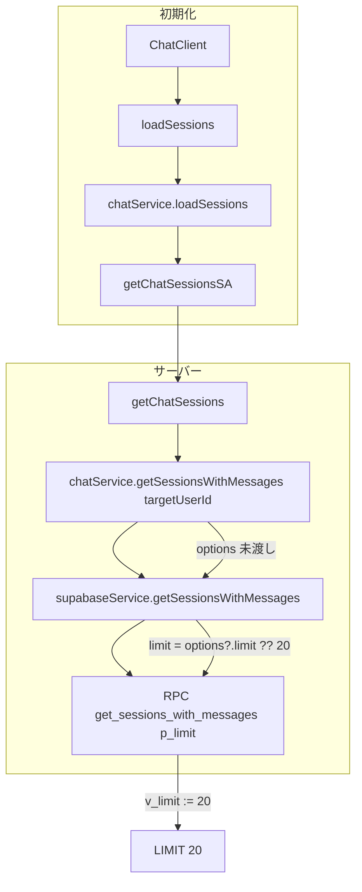
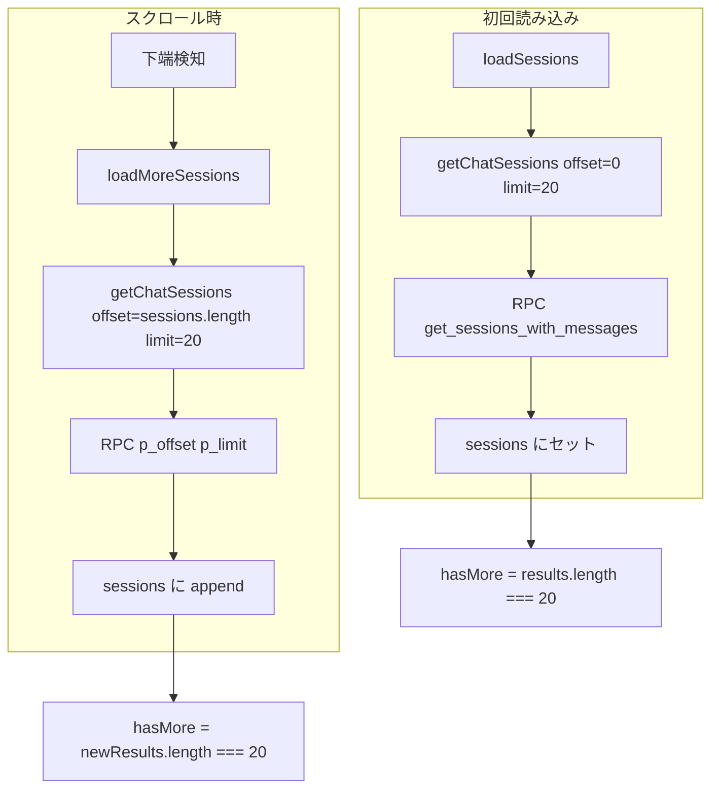

# サイドバー チャットセッション 無限スクロール 仕様書

> サイドバーのチャットセッション一覧が20件で止まる問題を、一般的なチャットアプリと同様の**無限スクロール**で解消する。

**注記（行番号について）**: 本仕様書に記載の行番号は作成時点のものであり、コード変更により変わる可能性があります。参照時はファイル内検索で該当箇所を特定してください。

## 1. 目的

サイドバーのチャットセッション一覧で、21件目以降のセッションも表示できるようにする。一般的なチャットアプリ（Slack、Discord、LINE、ChatGPT 等）と同様に、**下スクロールで追加取得**する無限スクロールを採用する。

## 2. スコープ

- **対象**: セッション一覧の無限スクロール、RPC `get_sessions_with_messages` の `p_offset` 追加、フロントエンドのスクロール検知
- **非対象**: 検索結果の無限スクロール（検索は別ロジック）、セッション一覧の並び順変更、UI デザインの大幅変更

## 3. 問題の概要

### 3.1 現象

- **症状**: サイドバーのチャットセッション一覧が20件で表示されなくなる
- **影響**: 21件目以降のセッションが一覧に表示されない。ページネーションや「もっと見る」は存在しない

### 3.2 データフロー（現状）



### 3.3 関連ファイル

| ファイル | 役割 |
| -------- | ---- |
| `app/chat/components/SessionSidebar.tsx` | セッション一覧表示、検索結果表示の切り替え |
| `app/chat/components/SessionListContent.tsx` | セッションリストの描画 |
| `src/hooks/useChatSession.ts` L69-80 | `loadSessions` コールバック |
| `src/domain/services/chatService.ts` L115-118 | `loadSessions` → `getChatSessionsSA` 呼び出し |
| `src/server/actions/chat.actions.ts` L203-224 | `getChatSessions`、limit を渡していない |
| `src/server/services/chatService.ts` L488-496 | `getSessionsWithMessages`、options を受け取るが未使用 |
| `src/server/services/supabaseService.ts` L526-534 | `getSessionsWithMessages`、`options?.limit ?? 20` |
| `supabase/migrations/20260107000001_update_chat_rpcs.sql` | RPC `get_sessions_with_messages` 定義 |

## 4. 根本原因

**limit が呼び出しチェーンで一度も渡されず、デフォルト 20 が適用されている。**

| 層 | ファイル | 現状 |
| -- | -------- | ---- |
| Server Action | `src/server/actions/chat.actions.ts` L211 | `chatService.getSessionsWithMessages(targetUserId)` — **第2引数なし** |
| SupabaseService | `src/server/services/supabaseService.ts` L530 | `const limit = options?.limit ?? 20` → **20** |
| RPC | `get_sessions_with_messages` | `p_limit` 未指定時は `v_limit := 20`、最大 100 まで対応 |

RPC は `p_limit` 1〜100 を許容するが、呼び出し元が limit を渡していないため常に 20 件になる。また、`p_offset` が存在しないためページングができない。

## 5. 修正仕様

### 5.1 修正方針: 無限スクロール

一般的なチャットアプリと同様に、**下スクロールで追加取得**する無限スクロールを採用する。

- **初回**: 直近 20 件を取得して表示
- **スクロール**: 下端に近づいたら次の 20 件を取得して末尾に追加
- **終了判定**: 取得件数が limit 未満になったら `hasMore = false`

### 5.2 データフロー（修正後）



### 5.3 定数

| 定数名 | 値 | 説明 |
| ------ | --- | ---- |
| `SESSION_LIST_PAGE_SIZE` | 20 | 1回あたりの取得件数 |

`src/lib/constants.ts` に追加する。

### 5.4 RPC 拡張

`get_sessions_with_messages` に `p_offset` を追加する。

**変更内容:**

- 引数: `p_offset integer default 0` を追加
- 変数: `v_offset integer := 0` を追加
- 検証: `p_offset >= 0` の場合に `v_offset` を設定
- SQL: `user_sessions` CTE に `OFFSET v_offset` を追加

**必須**: `ORDER BY last_message_at DESC` で同点のセッションがある場合、ページングで重複や欠落が確実に発生する。`ORDER BY last_message_at DESC, id ASC` で tie-breaker を追加すること。

### 5.5 Server Action 拡張

`getChatSessions` に `options?: { limit?: number; offset?: number }` を追加する。

```typescript
export async function getChatSessions(
  liffAccessToken: string,
  options?: { limit?: number; offset?: number }
) {
  // ...
  const serverSessions = await chatService.getSessionsWithMessages(targetUserId, {
    limit: options?.limit ?? SESSION_LIST_PAGE_SIZE,
    offset: options?.offset ?? 0,
  });
  // ...
}
```

### 5.6 サービス層の拡張

| ファイル | 変更内容 |
| -------- | -------- |
| `src/server/services/chatService.ts` | `getSessionsWithMessages(userId, { limit, offset })` で offset を渡す |
| `src/server/services/supabaseService.ts` | `getSessionsWithMessages` に `offset` を追加、RPC に `p_offset` を渡す |

### 5.7 Domain 層の拡張

| ファイル | 変更内容 |
| -------- | -------- |
| `src/domain/interfaces/IChatService.ts` | `loadMoreSessions(offset: number): Promise<ChatSession[]>` を追加 |
| `src/domain/services/chatService.ts` | `loadMoreSessions(offset)` を実装。`getChatSessionsSA` に `{ limit, offset }` を渡す |
| `src/domain/models/chatModels.ts` | `ChatState` に `hasMoreSessions: boolean`、`isLoadingMoreSessions: boolean` を追加 |

### 5.8 フロントエンド

| ファイル | 変更内容 |
| -------- | -------- |
| `src/types/hooks.ts` | `ChatSessionActions` に `loadMoreSessions: () => Promise<void>` を追加 |
| `src/hooks/useChatSession.ts` | `loadMoreSessions` コールバックを実装。`loadSessions` は offset=0 で初回取得。`loadMoreSessions` は offset=sessions.length で追加取得し append。`isLoadingMoreSessions` で二重呼び出しを防止。**失敗時は `isLoadingMoreSessions` を false に戻す**（5.10 参照） |
| `app/chat/components/SessionSidebar.tsx` | `loadMoreSessions`、`hasMoreSessions`、`isLoadingMoreSessions` を props で受け取り、SessionListContent に渡す |
| `app/chat/components/SessionListContent.tsx` | リスト下端に sentinel 要素を配置。IntersectionObserver で下端検知時に `onLoadMore` を呼ぶ。`hasMore` かつ `!isLoadingMore` のときのみ発火。検索中（`showSearchResults`）のときは sentinel を非表示 |
| `app/chat/components/ChatLayout.tsx` | SessionSidebar に `loadMoreSessions`、`hasMoreSessions`、`isLoadingMoreSessions` を渡す |

### 5.9 無限スクロールのトリガー

- **IntersectionObserver**: リスト最下部に「読み込みトリガー」用の div（sentinel）を配置
- その div が viewport（スクロールコンテナ）に入ったら `loadMoreSessions` を実行
- `hasMoreSessions === false` または `isLoadingMoreSessions === true` のときは発火しない
- 検索中（`showSearchResults`）のときは無限スクロールを無効化

### 5.10 エラーハンドリングとステート管理

#### エラー時の状態リセット

`loadMoreSessions` が失敗した場合、**必ず `isLoadingMoreSessions` を false に戻す**。これを怠ると、ネットワークエラー後に無限スクロールが永久に動作しなくなる（`isLoadingMoreSessions` が true のまま残り、二重呼び出しガードでブロックされる）。

```typescript
// useChatSession の loadMoreSessions 内
try {
  setState(prev => ({ ...prev, isLoadingMoreSessions: true }));
  const newSessions = await chatService.loadMoreSessions(prev.sessions.length);
  // ...
} catch (error) {
  // 必須: 失敗時は isLoadingMoreSessions を false に戻す
  setState(prev => ({ ...prev, isLoadingMoreSessions: false }));
  // エラー通知（5.10.2 参照）
}
```

#### エラー表示

追加取得失敗時は、ユーザーに**トーストでエラーを通知**する。既存の `toast.error` パターン（例: セッション削除時）に合わせる。エラーメッセージ例: 「追加のチャット履歴の読み込みに失敗しました。スクロールして再試行してください。」

#### 検索トグル時の状態保持

検索→通常表示に戻った際は、**既に読み込んだセッションとページング状態（`hasMoreSessions`、`isLoadingMoreSessions`）を保持する**。検索クリア時に `loadSessions` を再実行して一覧をリセットしない。これにより、ユーザーがスクロールして取得した状態が検索の切り替えで失われない。

## 6. 実装詳細

### 6.1 マイグレーションの構成

1. 新規マイグレーションファイルを `supabase/migrations/` に作成
2. ファイル名: `YYYYMMDDHHMMSS_add_offset_to_get_sessions_with_messages.sql`
3. **既存の関数定義全体をコピー**し、以下を変更する:
   - `p_offset` の追加と `OFFSET v_offset` の適用
   - **`ORDER BY last_message_at DESC` を `ORDER BY last_message_at DESC, cs.id ASC` に変更**（tie-breaker 必須。同点時の重複・欠落を防ぐ）
4. ロールバック案をコメントで記載する（AGENTS.md 準拠）

**前提**: チャット検索エラー修正（`authenticator` 許可）のマイグレーションが先に適用されていること。本マイグレーションは `get_sessions_with_messages` の最新版（認証チェック修正済み）をベースに `p_offset` と ORDER BY の変更を追加する。

### 6.2 ロールバック案

#### 推奨: ロールバック用マイグレーションの新規作成

1. 新規ファイル `supabase/migrations/YYYYMMDDHHMMSS_rollback_offset_from_get_sessions.sql` を作成
2. `get_sessions_with_messages` から `p_offset` を削除した関数定義を記載
3. `npx supabase db push` で適用

#### 緊急時の手動ロールバック

Supabase Dashboard の SQL Editor で、`p_offset` を削除した関数定義を実行する。後から正式なロールバックマイグレーションを追加し、履歴を残すこと。

#### ロールバック後の検証

1. セッション一覧が 20 件で止まること（修正前の状態に戻る）
2. エラーが発生しないこと

## 7. 検証手順

### 7.1 事前準備

1. `npx supabase db push` でマイグレーションを適用
2. 開発サーバーを起動（`npm run dev`）
3. 21件以上のセッションを持つユーザーでチャット画面に遷移（不足する場合はテスト用にセッションを作成）

### 7.2 初回表示の検証

1. チャット画面を開く
2. 初回は 20 件表示されること
3. ローディング表示が適切に表示されること

### 7.3 無限スクロールの検証

1. セッション一覧を下にスクロールする
2. 下端に近づくとローディング表示が出ること
3. 次の 20 件が末尾に追加表示されること
4. 50 件以上ある場合、同様にスクロールで追加取得できること
5. 全件取得後、それ以上ロードされないこと（`hasMore = false`）

### 7.4 検索との併用

1. 検索バーに文字を入力して検索を実行
2. 検索結果が表示されること
3. 検索中は無限スクロールが動作しないこと（検索結果のみ表示）
4. 検索をクリアする
5. 通常のセッション一覧に戻り、無限スクロールが復活すること

### 7.5 エッジケース

1. 20 件ちょうどの場合: スクロールしても追加取得されないこと
2. 連続スクロール: 二重取得が発生しないこと（`isLoadingMoreSessions` のガード）
3. セッション削除後: 一覧が更新され、無限スクロールが継続して動作すること

## 8. 開発工数見積もり（余裕を持った見積もり）

| タスク | 工数 | 備考 |
| ------ | ---- | ---- |
| 定数追加・RPC マイグレーション | 1.5h | `p_offset` 追加、tie-breaker 検討、ロールバック案コメント |
| Server Action・サービス層 | 1h | offset の受け渡し、型更新 |
| Domain 層・型定義 | 0.5h | `loadMoreSessions` API、ChatState 拡張 |
| useChatSession フック | 1.5h | 状態管理、二重呼び出し防止、`hasMore` 更新 |
| SessionListContent・IntersectionObserver | 1.5h | sentinel 配置、スクロール検知、検索時無効化 |
| SessionSidebar・ChatLayout | 0.5h | props の受け渡し |
| ローカル検証 | 1.5h | 21件以上・50件以上での動作確認、エッジケース |
| 想定外対応バッファ | 1.5h | 型再生成、環境差異、統合時の不具合 |
| セルフレビュー・Lint・コミット | 0.5h | `npm run lint`、`git diff` 確認 |
| **合計** | **9h** | 最小 5h / 標準 7h / 余裕込み 9h |

### 8.1 稼働前提

- 1 日 3h 稼働の場合: 約 3 日
- 4 日確保すれば十分な余裕あり

## 9. 補足

### 9.1 検索機能との関係

検索結果は `searchChatSessions` で別取得する。検索中は `sessions` ではなく `searchResults` を表示するため、無限スクロールはセッション一覧表示時のみ有効とする。

### 9.2 重複防止

`loadMoreSessions` 呼び出し中は `isLoadingMoreSessions` を true にし、連続呼び出しを防ぐ。

### 9.3 database.types.ts

RPC の型定義が変わるため、`npx supabase gen types` で再生成が必要な場合がある。

### 9.4 依存関係

本修正は、チャット検索エラー修正（`authenticator` 許可）のマイグレーションが先に適用されていることを前提とする。`get_sessions_with_messages` の認証チェックが未修正の場合、セッション一覧の初回読み込み自体が失敗する可能性がある。

## 10. 変更箇所一覧

| 層 | ファイル | 変更内容 |
| -- | -------- | -------- |
| 定数 | `src/lib/constants.ts` | `SESSION_LIST_PAGE_SIZE` 追加 |
| DB | `supabase/migrations/` | 新規マイグレーション: RPC に `p_offset` 追加 |
| Server Action | `src/server/actions/chat.actions.ts` | `getChatSessions` に options 追加 |
| Server | `src/server/services/chatService.ts` | `getSessionsWithMessages` に offset 対応 |
| Server | `src/server/services/supabaseService.ts` | `getSessionsWithMessages` に offset 対応 |
| Domain | `src/domain/services/chatService.ts` | `loadMoreSessions(offset)` 実装 |
| Domain | `src/domain/interfaces/IChatService.ts` | `loadMoreSessions` 型定義追加 |
| Domain | `src/domain/models/chatModels.ts` | ChatState に hasMore, isLoadingMore 追加 |
| Types | `src/types/hooks.ts` | ChatSessionActions に loadMoreSessions 追加 |
| Hooks | `src/hooks/useChatSession.ts` | `loadMoreSessions` 実装 |
| UI | `app/chat/components/SessionListContent.tsx` | IntersectionObserver + sentinel |
| UI | `app/chat/components/SessionSidebar.tsx` | loadMoreSessions 等を props で受け渡し |
| UI | `app/chat/components/ChatLayout.tsx` | SessionSidebar に新しい props を渡す |

## 11. 変更履歴

| 日付 | 内容 |
| ---- | ---- |
| 2026-03-06 | 初版作成 |
